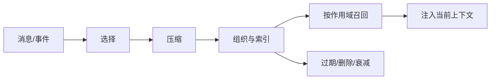
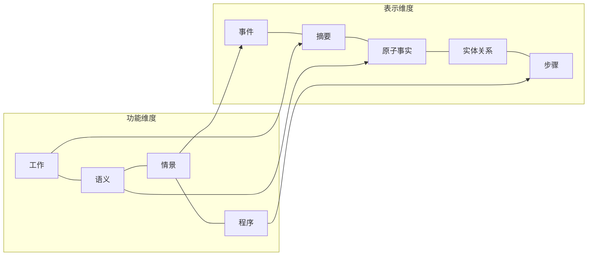
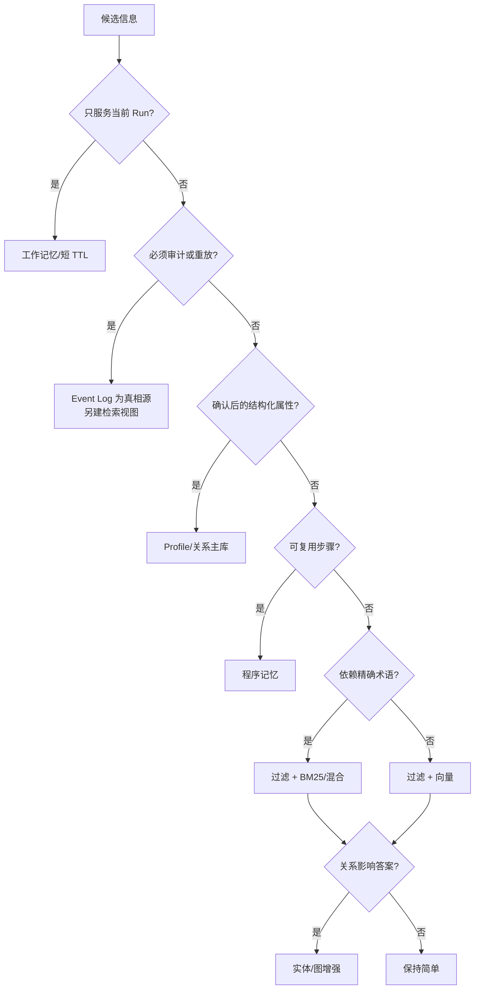
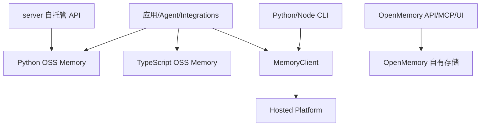
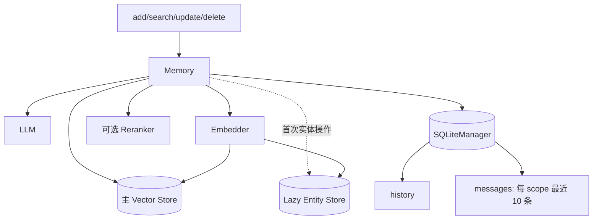
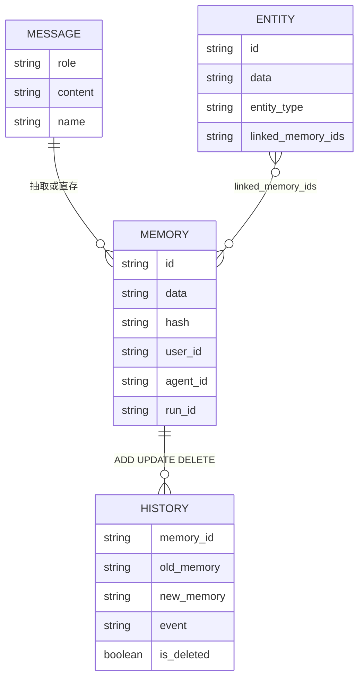
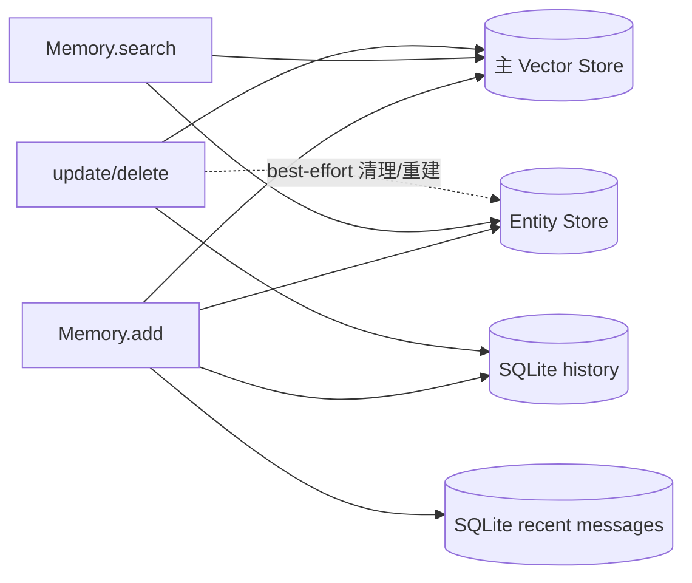
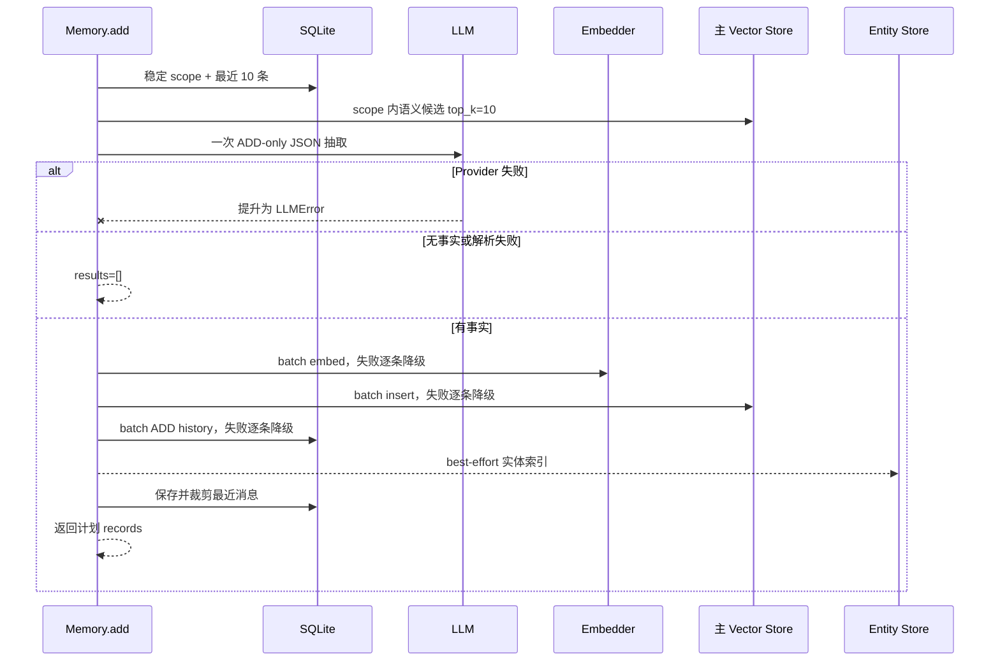
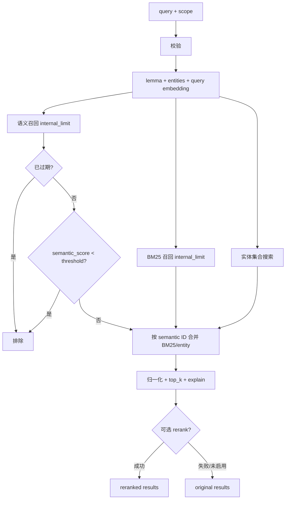
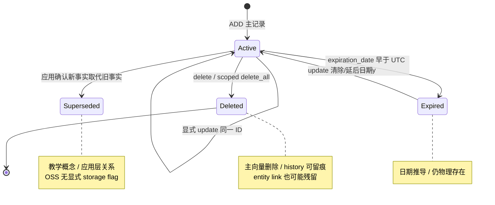

# 从第一性原理到 Mem0 源码：长期记忆系统设计教程

> 本教程面向具备后端、RAG 与 Agent harness 基础的读者。运行项目不是学习终点；目标是掌握可迁移的记忆系统设计方法。

## 1. 导读：如何学习一个记忆系统 {#chapter-1}

### 1.1 学习目标与贯穿案例

**直觉。** 假设你在构建带长期记忆的 AI 编程助手。用户说“示例默认用 Python，回答先给结论”，后来又排查过 Qdrant 向量维度不一致，并形成“改 TypeScript 后依次运行 typecheck、test、build”的习惯。当前任务正在分析混合检索；新项目又从 Redis 改用 pgvector。这些文本的归属、寿命和用法都不同，不能只是“全部放进向量库”。

**模型。** 记忆系统要持续回答五个设计问题：

1. **什么值得记（what is memorable）**：哪些信息对未来有价值？
2. **如何表示（how represented）**：事件、摘要、原子事实、关系还是步骤？
3. **归谁所有（who owns it）**：User、Agent、Run 还是 Organization？
4. **如何召回（how retrieved）**：精确、向量、关键词、实体、图还是混合检索？
5. **何时遗忘（when forgotten）**：瞬时、TTL、长期、衰减还是审计保留？

输入是消息和业务上下文，输出是带作用域、表示、索引字段与生命周期的记录；约束包括隔离、可追溯、延迟、成本和隐私。读完前五章，读者应能区分记忆与相邻系统，完成分类选型，画出 Python OSS `Memory` 的组件与存储边界，并准确区分 OSS 和 Hosted Platform。

**候选方案。** 可以从 quickstart 向下追 API、从数据库表向上猜架构，或先建模型再对照源码。前两种快，却容易把某版本的偶然实现当成原理。

**选择。** 本文采用“设计决策 + 最小实现 + 当前源码证据”：先问约束，再比较候选方案，最后检查定义、调用点和失败边界。

### 1.2 三类代码标记

| 标记 | 含义 | 证据强度 |
|---|---|---|
| `概念伪代码` | 压缩表达算法或架构，可能省略异常 | 只用于推理 |
| `教学实现` | 可独立理解或验证的简化 Python | 证明机制，不代表 Mem0 行为 |
| `Mem0 源码` | 与当前仓库文件、符号核对的片段 | 可支持当前版本结论 |

**数据流。** 学习顺序本身也是一条验证链。

**概念伪代码（Mermaid）**


**教学实现。** 下面的函数提醒我们：不同标签不能互相冒充。

**教学实现**
```python
def evidence_scope(tag: str) -> str:
    levels = {
        "概念伪代码": "idea",
        "教学实现": "mechanism",
        "Mem0 源码": "current_repository",
    }
    return levels[tag]
```

**Mem0 源码对照。** `mem0/__init__.py` 暴露两组入口：本地 OSS 组合对象与 Hosted Platform 客户端。

**Mem0 源码**
```python
from mem0.client.main import AsyncMemoryClient, MemoryClient
from mem0.memory.main import AsyncMemory, Memory
```

名称相近不代表执行位置、存储或能力相同。`Memory` / `AsyncMemory` 在本进程组装 Provider；`MemoryClient` / `AsyncMemoryClient` 访问远端服务。

### 1.3 推荐阅读路线

系统设计读者可按第 2→3→5 章阅读；源码读者先用第 4 章定位边界，再从 `Memory.__init__()`、`add()`、`search()` 展开；实验读者先建立分类模型，再运行后续本地教学实现。真实 DeepSeek、Qdrant 和 API Key 只应是可选实验。

**取舍。** 设计先行比复制示例慢，却能避免把 transcript 当 memory、漏掉作用域过滤、或误把多存储 best-effort 写入当成事务。代价是同时维护理论与实现两张图，因此本文始终用三类代码标签标明证据。

**本章练习与面试思考：**

1. **代码阅读题：** 沿 `mem0/__init__.py` 的四个导出找到定义，判断哪些类本地组装存储、哪些类调用远端。
2. **设计决策题：** “当前正在分析混合评分”应放 Run 级还是 User 级？根据寿命、误召回影响和删除条件选择。
3. **面试题：** 为什么长上下文不能替代长期记忆？从选择压缩、跨请求状态、作用域、冲突、成本与遗忘回答。

## 2. 从第一性原理理解记忆 {#chapter-2}

### 2.1 为什么上下文窗口不是长期记忆

**直觉。** 上下文窗口像当前工作台，长期记忆像经过整理的档案。扩大桌面不会自动决定哪些纸应归档、归谁、何时作废。

**模型。** 上下文是一次推理的输入序列，优化当前生成；长期记忆是跨请求状态系统，优化未来在正确作用域和时间召回有用信息。全量重放会使成本随历史增长，噪声挤占注意力，敏感与过时信息反复传播。

### 2.2 聊天记录、缓存、RAG、画像、事件日志与记忆

**候选方案。** 滚动摘要节省 token 但会累积压缩误差；纯 RAG 擅长找相对稳定的外部证据，却不决定对话中什么值得记；显式记忆层增加写路径复杂度，换来选择、归属和遗忘策略。实践中常组合使用。

| 载体 | 目的 | Source of truth | 写策略 | 检索 | 生命周期 | 失败影响 |
|---|---|---|---|---|---|---|
| Context window | 当前推理 | 当前请求编排 | 每次组装 | 模型注意力 | 请求/短会话 | 当前回答降质 |
| Transcript | 忠实对话 | 原始消息 | 追加为主 | 会话、时间 | 合规期限 | 失去审计/重放 |
| Cache | 降低重复计算 | 上游系统 | 可重建覆盖 | 精确 key | TTL/LRU | 延迟升高或短暂陈旧 |
| RAG corpus | 提供文档证据 | 文档/知识库 | 采集、切块、版本化 | 向量/关键词/过滤 | 跟随语料 | 召回遗漏或无依据 |
| Profile | 稳定结构化属性 | 业务主库/确认字段 | 校验后 upsert | 主键/字段 | 属性有效期 | 个性化或权限错误 |
| Event log | 重放与审计 | 不可变事件序列 | append-only | 实体/时间/类型 | 长期/法规期限 | 状态不可重建 |
| Long-term memory | 未来任务复用经验 | 通常是带出处的派生状态 | 抽取、去重、更新、过期 | scope + 多路信号 | TTL/长期/衰减 | 错记、串租户、陈旧决策 |

**选择。** 若“默认 Python”由设置页确认，Profile 是权威源，记忆只是检索副本；若它仅来自对话，Transcript 是证据，抽取记忆是可纠错的派生判断。正式配置变更应以配置库为准，而非让记忆取代配置管理。

### 2.3 记忆系统的五个动作：选择、压缩、组织、召回、遗忘

**数据流。** 选择过滤寒暄与低价值信息；压缩形成摘要、事实或步骤；组织附加 scope、时间、实体、hash 与 Embedding；召回先过滤再生成候选和排序；遗忘执行 TTL、删除、衰减或冲突替代。

**概念伪代码（Mermaid）**


规则选择确定且便宜，覆盖有限；LLM 理解隐含偏好，却会误抽取或返回非法结构。只建向量索引简单；增加关键词和实体信号更稳健，却放大写入与一致性成本。

### 2.4 从业务约束推导系统不变量

应先定义六个不变量：作用域过滤先于相似度；原始证据与派生记忆可区分；创建、更新、事件与过期时间不混用；部分失败可观察和修复；删除覆盖派生副本；召回内容仍是不可信输入。

**教学实现。** 最小入口先验证 scope，再让后续策略执行。

**教学实现**
```python
def validate_scope(scope: dict[str, str | None]) -> dict[str, str]:
    keys = ("user_id", "agent_id", "run_id")
    clean = {key: scope[key].strip() for key in keys if scope.get(key)}
    if not clean:
        raise ValueError("at least one scope id is required")
    return clean
```

**Mem0 源码对照。** `mem0/memory/main.py::_build_filters_and_metadata()` 校验并修剪这三个 ID，将全部已提供 ID 同时加入存储 metadata 与查询 filters；三者皆空则抛出 `Mem0ValidationError`。这落实操作 scope，但不替代 API 鉴权，也不能保证自定义 Provider 的底层隔离。

**Mem0 源码**
```python
if not session_ids_provided:
    raise Mem0ValidationError(
        message="At least one of 'user_id', 'agent_id', or 'run_id' must be provided.",
        error_code="VALIDATION_001",
    )
```

### 2.5 本章练习与面试思考

**取舍。** 关系主库事务提交后异步建索引，恢复容易但搜索短暂最终一致；直接写多个存储部署轻，却需幂等、对账和补偿。保留 transcript 利于审计，也扩大隐私面。应从失败影响推导方案，而非从 Vector Store 反推需求。

1. **代码阅读题：** 同时给 `_build_filters_and_metadata()` 传 `user_id` 与 `run_id`，检查两个返回 dict；再定位无 scope 的错误路径。
2. **设计决策题：** “向量维度不一致导致写入失败”应只存情景记忆还是同时进 event log？比较真相源、审计和期限。
3. **面试题：** 用“什么值得记、如何表示、归谁、如何召回、何时遗忘”映射写策略、schema、隔离、索引和生命周期。

## 3. 记忆分类与设计选型 {#chapter-3}

### 3.1 按功能：工作、语义、情景与程序记忆

**直觉。** “正分析混合评分”服务当前任务；“默认 Python”是稳定事实；“曾因维度错误写入失败”是经历；“typecheck→test→build”是方法。

| 类型 | 回答的问题 | 案例 | 典型召回/寿命 |
|---|---|---|---|
| 工作 | 现在做什么？ | 当前分析任务 | Run 内直接读 |
| 语义 | 稳定事实是什么？ | 默认 Python | scope + 语义/精确；长期 |
| 情景 | 何时发生过什么？ | 维度故障与解决 | 时间/实体/语义；中长期 |
| 程序 | 应按什么步骤做？ | typecheck→test→build | Agent/任务；流程有效期 |

### 3.2 按归属：User、Agent、Run 与 Organization

**模型。** 归属回答“谁的未来行为能使用”，不是“谁说了话”。User 级存个人偏好，Agent 级存角色习惯，Run 级存任务状态，Organization 级存审核后的团队规范。当前 Python OSS 一等 scope 是 `user_id`、`agent_id`、`run_id`，可同时提供；没有等价 `organization_id` 参数。组织级即使放 metadata，也仍需应用层授权。

### 3.3 按表示：事件、摘要、原子事实、实体关系与步骤

事件保真但量大；摘要省 token 但难局部更新；原子事实易去重与召回但会丢语气；实体关系利于关联扩展但消歧昂贵；步骤保存顺序和前置条件。Mem0 当前自动推断主路径抽取新的原子记忆，实体随后写独立集合，以 `linked_memory_ids` 指回主记忆。提示词中的关联字段和实体索引是不同层，不能只凭 prompt 声称记忆图已持久化。

### 3.4 按生命周期：瞬时、TTL、长期、衰减与审计

**候选方案。** 瞬时状态随 Run 删除；TTL 是硬截止；长期记忆允许显式纠错；衰减降低排序权重；审计保留维护不可抵赖事件。它们不可互换。当前 OSS `expiration_date` 是日期，搜索与列表默认隐藏已过期记录；`timestamp` 被明确拒绝为 Platform-only temporal parameter，`_OSSProject.update(decay=True)` 也提示边界。因此不能声称本地 `Memory` 已有完整时间推理或衰减。

### 3.5 按检索：精确、向量、关键词、实体、图与混合检索

精确检索用于 ID 与强过滤；向量处理语义改写；BM25 保留错误码和专名；实体扩展关联；图适合多跳；混合检索融合信号。

**选择。** 必须先做 scope 精确过滤，再按查询特点组合信号。问“index size 报错”时，向量找相似故障，BM25 捕捉术语，实体提升 Qdrant/Embedding 关联。`VectorStoreBase.keyword_search()` 默认返回 `None`，统一方法名不保证具体 Provider 支持关键词检索。

### 3.6 选型矩阵与决策树

**数据流。** “功能 × 表示”是二维分类，约束再决定检索与生命周期。

| 功能 \ 表示 | 事件 | 摘要 | 原子事实 | 实体关系 | 步骤 |
|---|---|---|---|---|---|
| 工作 | 工具日志 | 任务摘要 | 当前约束 | 活跃组件 | 下一动作 |
| 语义 | 事实来源 | 画像摘要 | 默认 Python | 项目—存储 | — |
| 情景 | 故障时间线 | 复盘 | 曾发生错误 | 故障—组件 | 恢复步骤 |
| 程序 | 执行轨迹 | SOP 摘要 | 前置条件 | 工具依赖 | 有序流程 |

**概念伪代码（Mermaid）**


**概念伪代码（Mermaid）**


**教学实现。** 下例把一致性、解释性和寿命约束转成可测试选择，而不是用名词堆砌。

**教学实现**
```python
from dataclasses import dataclass


@dataclass(frozen=True)
class Constraints:
    run_only: bool = False
    audited: bool = False
    exact_terms: bool = False


def choose_design(c: Constraints) -> tuple[str, str]:
    if c.run_only:
        return "working", "ttl"
    if c.audited:
        return "event_log+derived_memory", "exact+semantic"
    return "atomic_fact", "hybrid" if c.exact_terms else "semantic"
```

### 3.7 Mem0 理论分类与当前 API 能力的差异

**Mem0 源码对照。** 枚举定义三种理论类型。

**Mem0 源码**
```python
class MemoryType(Enum):
    SEMANTIC = "semantic_memory"
    EPISODIC = "episodic_memory"
    PROCEDURAL = "procedural_memory"
```

`SEMANTIC` 表示可跨事件复用的事实，`EPISODIC` 表示经历，`PROCEDURAL` 表示步骤；但当前 OSS `add()` 不提供对称入口。

**Mem0 源码**
```python
if memory_type is not None and memory_type != MemoryType.PROCEDURAL.value:
    raise Mem0ValidationError(...)

if agent_id is not None and memory_type == MemoryType.PROCEDURAL.value:
    return self._create_procedural_memory(messages, metadata=processed_metadata, prompt=prompt)
```

显式传 `semantic_memory` 或 `episodic_memory` 会被拒绝；只有 `agent_id` 与 `procedural_memory` 同时存在才进入程序摘要分支。其他写入走通用抽取/直存路径；异步路径有对应分支。

### 3.8 本章练习与面试思考

**取舍。** 单集合加类型字段易运营但过滤要求高；按类型分集合可定制索引和 TTL，却增加跨类型召回。显式程序分支清晰，也容易让人误以为枚举能力对称，应用封装应保留自己的领域映射。

1. **代码阅读题：** 比较同步/异步 `add()` 的类型校验、procedural 条件和返回结构。
2. **设计决策题：** “Redis 改用 pgvector”应存事件、当前事实还是二者并存？说明真相源、时间和冲突召回。
3. **面试题：** 从功能、归属、表示、生命周期、检索五维说明分类如何改变 schema、索引、权限、TTL 与评估。

## 4. Mem0 的宏观架构 {#chapter-4}

### 4.1 Monorepo 地图

**直觉。** 搜到同名 `Memory` 就逐行读，会把本地 SDK、远程客户端和完整应用混在一起。先问算法在哪执行、状态在哪持久化、信任边界在哪。

**模型。** 本教程以 Python OSS `mem0/memory/main.py::Memory` 为主证据；`mem0/client/main.py` 只证明远程调用边界，不反推 Hosted Platform 内部。

| 路径 | 职责 | 关键边界 |
|---|---|---|
| `mem0/` | Python 本地 Memory、Platform client、Provider | 本地与远程入口并存 |
| `mem0-ts/` | TypeScript hosted client + OSS memory | 不假设内部与 Python 完全相同 |
| `server/` | 自托管 API 服务 | 不是 Hosted Platform 开源镜像 |
| `openmemory/` | FastAPI/MCP 后端 + Next.js UI | 有独立应用架构和迁移链 |
| `cli/python/`、`cli/node/` | 终端工作流 | 调用入口，不是算法真相源 |
| `integrations/` | Agent、编辑器与框架适配 | 决定何时调用核心能力 |
| `docs/` | API、概念、集成、迁移文档 | 版本行为仍需源码核对 |

**概念伪代码（Mermaid）**


### 4.2 OSS Library、Server、OpenMemory 与 Platform

**候选方案。** Library 在应用进程内运行，透明但由应用承担密钥、扩缩容和一致性；Server 提供集中 API 与鉴权，增加网络和运维；OpenMemory 提供 UI、MCP 与完整自托管体验；Hosted Platform 通过客户端使用托管能力，降低运维但改变数据、成本和网络边界。

| 形态 | 执行/状态边界 | 接口 | 适用场景 |
|---|---|---|---|
| OSS Library | 应用进程；配置的 Vector Store + SQLite | `Memory` / `AsyncMemory` | 原型、嵌入式服务 |
| Self-Hosted Server | 自建容器与数据库 | HTTP API | 团队共享、集中治理 |
| OpenMemory | 自建完整应用 | UI、API、MCP | 可视化与 Agent 工具 |
| Hosted Platform | Mem0 托管边界 | Client/API | 零运维与平台能力 |

**选择。** 为了证据可复核，本文解剖 OSS Library。Server 鉴权、OpenMemory 数据模型与 Platform 的时间、衰减、规模能力不从 `Memory` 推断。

### 4.3 Memory 的组件组合

**数据流。** `Memory` 协调 LLM 抽取/摘要、Embedder、主 Vector Store、可选 Reranker、SQLite history/recent messages 和惰性 Entity Store。

**概念伪代码（Mermaid）**


初始化时 `_entity_store = None`。自动写入会读取最近消息与主向量候选，抽取、Embedding、写主集合和 history，再 best-effort 建实体索引并保存最近消息；这些箭头跨多个故障边界。

### 4.4 Provider Factory 与依赖倒置

**教学实现。** 依赖倒置的核心是高层只依赖能力，由外部组合具体实现。

**教学实现**
```python
from dataclasses import dataclass
from typing import Protocol


class Embedder(Protocol):
    def embed(self, text: str, memory_action: str) -> list[float]: ...


@dataclass
class MemoryParts:
    llm: object
    embedder: Embedder
    vector_store: object
    reranker: object | None = None
```

**Mem0 源码对照。** `Memory.__init__()` 由配置调用 Factory，再创建 SQLiteManager。

**Mem0 源码**
```python
self.embedding_model = EmbedderFactory.create(
    self.config.embedder.provider,
    self.config.embedder.config,
    self.config.vector_store.config,
)
self.vector_store = VectorStoreFactory.create(
    self.config.vector_store.provider, self.config.vector_store.config
)
self.llm = LlmFactory.create(self.config.llm.provider, self.config.llm.config)
self.db = SQLiteManager(self.config.history_db_path)
```

若配置 reranker，再由 `RerankerFactory.create()` 创建。`MemoryConfig` 聚合 Vector Store、LLM、Embedder、可选 Reranker、history 路径、版本和自定义指令；当前默认 Vector Store 是 Qdrant，LLM/Embedder 是 OpenAI。

`LLMBase` 要求 `generate_response()`；`EmbeddingBase` 要求 `embed()`，默认 `embed_batch()` 逐条调用；`VectorStoreBase` 要求增删改查与集合管理，规定搜索分数越高越相似，`keyword_search()` 默认 `None`，`search_batch()` 默认逐条。Factory 统一创建，不抹平分数尺度、事务、批量和检索能力差异。

### 4.5 同步与异步接口

Python OSS 导出 `Memory` 与 `AsyncMemory`，Hosted 端导出 `MemoryClient` 与 `AsyncMemoryClient`。异步适合已有 event loop 和并发等待网络；同步适合脚本和简单任务。当前异步类有对应的初始化、惰性实体存储和 CRUD/history 路径，部分同步工作用 `asyncio.to_thread` 包装，因此 async 接口不保证每个 Provider 原生非阻塞，更不会把多存储操作变成事务。

### 4.6 本章练习与面试思考

**取舍。** 显式 Factory 映射可读、可控，但新增 Provider 要注册；动态插件发现更开放，也更难调试和治理。进程内组合最透明，服务化利于多语言与集中授权，托管降低运维；选择应由团队能力、数据边界和故障预算决定。

1. **代码阅读题：** 从 `Memory.__init__()` 画出四个 Factory 的输入输出，再读 `entity_store` property，说明 lazy 初始化和集合名派生。
2. **设计决策题：** 20 人团队让 Python、TS 和编辑器插件共享记忆，应选 Library 还是服务？比较鉴权、网络、升级和运维。
3. **面试题：** Provider Factory 解决什么、没解决什么？用 `VectorStoreBase.keyword_search()` 默认 `None` 解释能力差异。

## 5. 核心数据模型与系统不变量 {#chapter-5}

### 5.1 Message、Memory、Entity 与 History

**直觉。** “项目改用 pgvector”是 Message；抽取出的当前事实是 Memory；项目和 pgvector 是 Entity；更新旧 Redis 事实形成 History。它们分别承担证据、可用状态、关联入口和变更解释。

**模型。** `Memory.add()` 接受字符串、dict 或 `list[dict]`。Message 是 API 输入结构，不是当前 `mem0/configs/base.py` 中的持久化 Pydantic 类；`MemoryItem` 才是结果模型，含 id、memory、hash、metadata、score 和时间。主 Memory 的 Vector Store payload 用 `data` 存正文；Entity payload 含 `data`、`entity_type`、`linked_memory_ids` 与 scope；SQLite History 保存 old/new、event、时间、删除标志和 actor/role。

**概念伪代码（Mermaid）**


这是逻辑关系，不是外键图：实体引用与 SQLite history 都没有对主 Vector Store 的数据库外键。

### 5.2 user_id、agent_id、run_id 与 actor_id

**候选方案。** 单一 tenant key 简单但难跨 Run 聚合；多个 scope ID 做 AND 过滤表达力强，却要求调用方稳定传齐。当前 OSS 选择“至少一个、多个可并存”。

| 字段 | 回答的问题 | 当前行为 | 可替代 scope？ |
|---|---|---|---|
| `user_id` | 属于哪个用户空间？ | 一等 scope，进入 metadata/filters | 是一类 scope |
| `agent_id` | 属于哪个 Agent？ | 一等 scope；procedural 分支条件 | 是一类 scope |
| `run_id` | 属于哪次任务？ | 一等 scope，适合临时隔离 | 是一类 scope |
| `actor_id` | 哪位参与者产生原始记录？ | 可额外过滤；直存时来自 message `name` | 否，只能缩小 scope |
| `role` | 对话协议角色？ | 直存保存 user/assistant，跳过 system | 否 |
| `attributed_to` | 抽取事实描述 user 还是 assistant？ | LLM 返回时写主 payload | 否，是语义归因 |

**选择。** scope 决定可访问空间，actor/role 描述输入来源，attribution 描述事实对象。把 `role="user"` 当 `user_id` 会串租户；把 `attributed_to` 当 `agent_id` 会把语义归因误作授权。

### 5.3 内容、hash、关键词、向量、时间与元数据

| 字段 | 职责 | 边界 |
|---|---|---|
| `data` / API `memory` | 人可读正文 | 不是原始 transcript |
| MD5 `hash` | 完全文本去重 | 不是语义去重/安全签名 |
| `text_lemmatized` | BM25 规范化文本 | 不替代原文/向量 |
| vector | 语义近邻 | 不承担权限过滤 |
| `created_at` / `updated_at` | 创建/显式更新时间 | 不等于事件发生时间 |
| `expiration_date` | 到期后默认隐藏 | 不等于衰减/隐私擦除 |
| metadata | scope 与业务过滤 | 自由字段不天然保证授权 |

自动抽取路径用文本 MD5 与已有候选和当前批次去重，无法识别“默认用 Python”和“首选 Python”的语义等价。显式 update 会重算 hash、lemmatized text 和向量。OSS 接受日期型 `expiration_date`，拒绝 Platform-only `timestamp`，所以不能把自然语言时间等同于 `created_at`。

### 5.4 主集合、实体集合和 SQLite 辅助状态

**数据流。** 主向量、惰性实体集合、SQLite history 和 SQLite messages 是四块逻辑状态。实体集合名由主集合名派生；Qdrant embedded 可共享 client，但仍是独立集合。

**概念伪代码（Mermaid）**


**关键不变量：vector memory、entity records、history、recent messages 是分离存储，没有共享事务。** 主 insert 后才写 SQLite history；实体链接是独立 best-effort；最近消息另开 SQLite 事务。可能出现主记录成功但 history/实体失败，或逐条降级导致部分成功。对外必须定义“成功包含哪些存储”，失败后也要能对账。

### 5.5 多租户隔离与作用域不变量

**教学实现。** 授权必须先于搜索，可信 scope 不能由 prompt 覆盖。

**教学实现**
```python
def authorized_recall(principal, query: str, requested_scope: dict[str, str]):
    allowed_scope = authorize(principal, requested_scope)
    if not allowed_scope:
        raise PermissionError("scope is not authorized")
    return memory_search(query=query, filters=allowed_scope)
```

**Mem0 源码对照。** `_build_filters_and_metadata()` 要求 `user_id`、`agent_id`、`run_id` 至少一个，并将全部已提供 ID 同时用于写 metadata 和查询 filters。`actor_id` 查询优先级是显式参数，其次是 filters 中已有值；它不进入基础写模板。`_build_session_scope()` 排序拼接三个 scope ID，为最近消息形成稳定分区。`infer=False` 为非 system 消息保存 role，并在有 name 时保存 actor_id。

**Mem0 源码**
```python
for key in sorted(["user_id", "agent_id", "run_id"]):
    val = filters.get(key)
    if val:
        parts.append(f"{key}={val}")
return "&".join(parts)
```

多租户还需要 API 鉴权、领域授权和底层 Provider 正确执行过滤；本地 ID 校验只覆盖查询构造的一部分。主记忆与实体都应带 scope，写、搜、更新、删除、对账使用同一规则；`actor_id` 只能缩小而不能扩大 scope。

**取舍。** scope 越细，泄漏半径越小，但跨项目学习需显式聚合。单库事务主表再异步索引易恢复但有新鲜度窗口；多 Provider + SQLite 灵活却依赖幂等、outbox/补偿和对账。组织共享记忆应审核写入，而非自动把任意对话升级为组织事实。

### 5.6 本章练习与面试思考

1. **代码阅读题：** 阅读 `SQLiteManager` 两张表，解释 `save_messages()` 如何按 `session_scope` 只保留最近 10 条。
2. **设计决策题：** 主向量成功、实体写失败时应返回成功、失败还是“待修复”？先定义实体是否为核心能力和重试幂等。
3. **面试题：** 用“访问空间—发送者—协议角色—事实对象”解释 `user_id`、`actor_id`、`role`、`attributed_to`。
4. **源码推演题：** 阅读 `_update_memory()`，列出文本变化时重算字段、actor 保留、history 与 entity cleanup 顺序及部分失败。

## 6. 写入生命周期：从对话到长期记忆 {#chapter-6}

### 6.1 写入前先定义不变量

**直觉。** 听到“默认用 Python”时，助手不应保存寒暄或暗改旧偏好；还要区分无事实、抽取故障和各存储结果。

**模型。** `消息 → scope 候选 → ADD 事实 → 主向量 → 辅助状态`。至少一个 scope；空抽取不等于 Provider 故障；多存储非原子。V3 是 **ADD-only**，不自动 UPDATE/DELETE。

**候选方案。** 原文直存噪声高；LLM 决定 CRUD 含破坏性动作；只抽新增事实再显式纠错，写放大较高但边界清楚。

**选择。** OSS 保留原文直存、程序摘要和默认 V3 批处理三路；下文以第三路为主。

### 6.2 Memory.add 的入口校验与三条分支

**数据流。** `Memory.add()` → `_build_filters_and_metadata()` → `_add_to_vector_store()`。入口处理时间字段、至少一个 scope ID 和消息列表规范化。

三条分支不能互相推断：

| 分支 | 处理方式 | 关键失败/返回 |
|---|---|---|
| `infer=False` | 跳过非法/`system` 消息，逐条 Embedding；保存正文、`role` 和可选 `actor_id` | 单条故障上抛；都是 `ADD` |
| `agent_id` + `procedural_memory` | LLM 总结成一条程序记忆 | 故障上抛；仅此 memory type 可显式传入 |
| 默认 `infer=True` | V3 分阶段批处理 | 单次抽取、批量降级、实体 best-effort；只有 `ADD` |

`semantic_memory`/`episodic_memory` 会报错；`infer=False` 仍需要 Embedder。

### 6.3 Phase 0-2：上下文、已有记忆与单次 LLM 抽取

Phase 0 按键名排序拼接 scope；`user_id="u1"`、`run_id="r7"` 得到稳定 key `run_id=r7&user_id=u1`。SQLite 按 key 分区，写后只留最近 10 条，读取时恢复时间正序。

Phase 1 在 scope 内语义搜索，固定 `top_k=10`。UUID 以小整数呈现给 LLM，并建反向 `uuid_mapping` 降低 ID 幻觉；后续主写未消费它。

Phase 2 只做一次 JSON LLM 调用；纯 agent scope 追加 agent 视角。解析失败再 `extract_json()`；空/最终解析失败/`memory=[]` 按无事实保存消息，Provider 异常提升为 `LLMError`。

### 6.4 Phase 3-6：批量 Embedding、hash 去重与持久化

Phase 3 对非空 `text` 做 batch Embedding，失败则逐条回退；仍失败的事实被跳过。Phase 4 用 lemma 生成 BM25 字段（spaCy 不可用则回退原文）。

Phase 5 用 `MD5(text)` 对 10 条旧候选和本批做**精确文本**去重；record 保存 UUID、正文、lemma、hash、scope、时间与归因。prompt 的 `linked_memory_ids` 未进主 payload。

Phase 6 的主 insert 与 `ADD` history 都批量优先、失败逐条回退。history 和返回值基于“计划 records”而非确认成功集合，故主记录失败时仍可能写 history、返回该 ID。

### 6.5 Phase 7-8：实体关联、最近消息与返回值

Phase 7 基于**全部计划 records** 批量抽取、去重并嵌入实体；先找精确匹配，再接受相似度 `≥0.95` 的匹配。它不知道 Phase 6 哪些逐条 insert 实际成功，因此可能写出指向主记录失败 ID 的 dangling entity links；整体 best-effort。

V3 prompt 的 `linked_memory_ids` 表示新旧 Memory 关联，但当前主路径不持久化它；真正写入的是 NLP 重抽实体后，在**独立实体集合**保存的 Entity→Memory 引用。两者不可混称 memory graph。

Phase 8 保存消息并返回计划 records；SQLite 失败上抛但不回滚先前主写。

**概念伪代码（Mermaid）**


### 6.6 ADD-only 与手动 UPDATE/DELETE 并不矛盾

“以前默认 Python，现在明确要求 Rust”会作为新事实 ADD。应用确认冲突后再显式 `update()`/`delete()`；自动 supersede 也应由应用保存关系，不能假设 V3 会改写旧 ID。

### 6.7 部分失败、降级与一致性分析

| 故障点 | 行为与后果 | 恢复 |
|---|---|---|
| LLM Provider / JSON 失败 | 前者 `LLMError`；后者按空抽取 | 分开告警与重试 |
| batch Embedding | 逐条回退，仍失败则漏 record | 补偿队列 |
| batch insert | 逐条回退；返回可能多于主存 | read-after-write |
| history | 逐条回退；主记录可能无审计 | outbox |
| entity | best-effort；可能缺链接或产生 dangling link | 重建索引 |
| messages | SQLite 回滚上抛；主存可能成功 | 幂等对账 |

这是**非原子 best-effort 多写**，不是事务，也不能仅凭调用结束称为最终一致性：源码没有内建 retry、outbox 或 reconciliation，不保证状态会自动收敛。只有应用增加幂等重试、主存确认、对账和实体重建后，才可把整套系统设计为 eventual consistency；history 是否为硬条件仍由合规策略定义。

### 6.8 教学伪代码与 Mem0 源码对照

**教学实现。** 改进接口只返回确认成功 ID；这不是当前结构。

**教学实现**
```python
def persist_individually(records, insert_one) -> tuple[list[str], list[str]]:
    persisted, failed = [], []
    for memory_id, vector, payload in records:
        try:
            insert_one(memory_id, vector, payload)
            persisted.append(memory_id)
        except Exception:
            failed.append(memory_id)
    return persisted, failed
```

**Mem0 源码对照。** Provider 故障被提升；payload 只读取 `text` 和 `attributed_to`。

**Mem0 源码**
```python
try:
    response = self.llm.generate_response(...)
except Exception as e:
    raise LLMError(f"LLM extraction failed: {e}") from e

mem_metadata["data"] = text
if mem.get("attributed_to"):
    mem_metadata["attributed_to"] = mem["attributed_to"]
```

**取舍。** 批量回退模糊全批成功；ADD-only 累积冲突；实体 best-effort 可静默降质。需补 per-record 状态、幂等与重建。

### 6.9 本章练习与面试思考

1. **代码阅读题：** 沿三条 add 分支列出 LLM、Embedding、主存和 SQLite 调用。
2. **设计决策题：** 某 record insert 失败时，设计返回、补偿与幂等策略。
3. **面试题：** 为什么解析失败的空列表仍不同于 Provider 失败？

## 7. 检索生命周期：从查询到排序结果 {#chapter-7}

### 7.1 查询校验、作用域与高级过滤

**直觉。** 问“上次 Qdrant index size 报错怎么解决”时，语义、关键词和实体各有盲区，而且必须先限定可信 user/run scope。

**模型。** 流程是 `scope → 语义候选 → 同 ID 的 BM25/实体信号 → 排序 → 可选 reranker`；候选全集由语义搜索决定。

**候选方案。** 加权相加可解释；RRF 抗尺度差；LTR 有表达力但需标注；reranker-only 简单却救不回漏召回。

**选择。** OSS 先语义过量召回，再按 ID 加 BM25/entity。高级 filters 的实际能力取决于 Provider。

query trim 后须非空，`threshold∈[0,1]`，`top_k` 是非负非 bool 整数；三个 scope ID 至少一个且必须放 filters。例如 `filters={"user_id": "u1", "AND": [{"project": {"eq": "mem0"}}, {"priority": {"gte": 2}}]}` 表示先限定用户空间，再以 project 与 priority 元数据继续收窄；scope 与这些条件组合，而非被 prompt 替换。协调层会转换 AND 与比较操作，但具体 Provider 能否忠实实现 `gte`、OR/NOT、`contains` 等仍须查其过滤适配并做集成测试。

### 7.2 查询预处理、Embedding 与过量召回

**数据流。** 原文用于 Embedding，lemma 用于 BM25，实体用于关联增益。两路召回上限是：

\[
L_{internal}=\max(4\times top\_k,\ 60)
\]

主向量与关键词搜索都用 `internal_limit`。Provider 未覆盖 `keyword_search()` 时返回 `None`，BM25 关闭；最终 candidates 仍只来自 semantic results。

评分前先过滤 `expiration_date < UTC today`（等于今天可见），再执行 `semantic_score < threshold`；BM25/entity 都救不回被剔除者。

**概念伪代码（Mermaid）**


### 7.3 BM25 归一化

BM25 raw 无固定上界。按 lemma term 数选择 sigmoid `(m,k)`：`≤3:(5,.7)`、`≤6:(7,.6)`、`≤9:(9,.5)`、`≤15:(10,.5)`、否则 `(12,.5)`；仅正分进入映射：

\[
bm25_{norm}=\frac{1}{1+e^{-k(raw-m)}}
\]

中点输出 0.5；这些是工程校准参数，不是概率。

### 7.4 实体索引与关联记忆增益

实体只取前 8 个并规范化去重，再 batch Embedding；数量错配则整路跳过。每实体并发搜索 `top_k=500`，相似度 `<0.5` 忽略。

实体记录含一组 `linked_memory_ids`。对每个命中的实体，设链接数为 \(n\)，稀释权重和 boost 为：

\[
w(n)=\frac{1}{1+0.001(n-1)^2},\qquad
entity\_boost=similarity\times 0.5\times w(n)
\]

同一 Memory 多次命中取最大 boost。`n=1` 权重为 1，`n=101` 约为 `1/11`，可抑制高连接实体。

### 7.5 融合公式、阈值和候选池限制

设某个语义候选为 \(d\)，当前精确公式是：

\[
raw(d)=semantic(d)+normalized\_bm25(d)+entity\_boost(d)
\]

\[
max\_possible=1.0+\mathbb{1}_{BM25\ active}\times1.0+\mathbb{1}_{entity\ active}\times0.5
\]

\[
final(d)=\min\left(\frac{raw(d)}{max\_possible},1.0\right)
\]

“active”是**查询全局**状态：`score_and_rank()` 在候选循环外用 `bool(bm25_scores)` / `bool(entity_boosts)` 固定一次分母。某候选缺少 keyed 分数时该项取 0，但仍使用同一全局分母。数值例：4-term query 得 `(m,k)=(7,.6)`；A 的 semantic=`.72`、raw BM25=`9`，规范后 `.769`；实体 similarity=`.8`、`n=1`，boost=`.4`。两路 active，分母 `2.5`：

\[
final_A=(0.72+0.769+0.4)/2.5\approx0.756
\]

若 threshold=`.75`，A 在相加**前**因 `.72 < .75` 被排除：语义候选/阈值先于 BM25/实体融合。

**教学实现。** 这个可运行函数只复现评分门控，不实现 Provider 搜索。

**教学实现**
```python
def hybrid_score(semantic, bm25, entity, threshold, *,
                 has_bm25: bool, has_entity: bool):
    if semantic < threshold:
        return None
    raw = semantic + (bm25 or 0.0) + (entity or 0.0)
    maximum = 1.0 + (1.0 if has_bm25 else 0.0)
    maximum += 0.5 if has_entity else 0.0
    return min(raw / maximum, 1.0)


assert round(hybrid_score(0.72, 0.769, 0.4, 0.1,
                          has_bm25=True, has_entity=True), 3) == 0.756
assert hybrid_score(0.72, None, None, 0.1,
                    has_bm25=True, has_entity=True) == 0.288
```

### 7.6 explain 与可选 reranker

**Mem0 源码对照。** `explain=True` 公开 semantic/BM25/entity、raw、上界、final 和 threshold。融合截断后才可选 rerank；失败 warning 并回退原结果。

**Mem0 源码**
```python
semantic_score = result.get("score") or 0.0
if semantic_score < threshold:
    continue
raw_combined = semantic_score + bm25_score + entity_boost
combined = min(raw_combined / max_possible, 1.0)
```

reranker 只接收融合后的 top_k，无法找回候选、过期或 threshold 阶段丢掉的记录。

### 7.7 真正多路召回与当前实现的对照

| 方案 | 候选 | 优点 | 取舍 |
|---|---|---|---|
| 当前加权相加 | 仅语义 | 快、可解释 | 精确词不能独立召回 |
| RRF | 多路并集 | 抗分数量纲 | 丢分差、需调常数 |
| Learning-to-rank | 多路并集 | 学习任务权重 | 需标注与漂移治理 |
| reranker-only | 前置单路 | 统一精排 | 漏召回不可恢复、成本高 |

真正多路召回应取三路 ID 并集；当前 BM25/entity 只给 semantic IDs 加分。

**取舍。** 加法易解释但需校准；阈值前置会误杀词法强结果。应分开评估候选、阈值、信号与 reranker。

### 7.8 本章练习与面试思考

1. **代码阅读题：** 沿 `_search_vector_store()` 标出过期过滤、语义阈值、BM25/entity 合并和 top-k 截断的精确顺序。
2. **设计决策题：** 错误码漏召回时，比较降 threshold、BM25 并集与 reranker。
3. **面试题：** 为什么 reranker 不是召回器？explain 如何支持治理？

## 8. 更新、遗忘、过期和历史 {#chapter-8}

### 8.1 新事实、冲突事实与显式更新

**直觉。** “默认 Python”变成“只用 Rust”既可是新事件，也可是纠错；覆盖会丢变化，追加会保留冲突。

**模型。** 教学状态为 Active、Superseded、Expired、Deleted。OSS 没有 superseded/deleted 主 payload flag：前者属应用关系，expired 由日期推导，delete 物理删除主向量而 history 可留痕。

**候选方案。** 追加保留事件，update 保持 ID，supersede 关系最清楚但需额外 schema 与过滤。

**选择。** V3 自动 ADD；确认后才显式 update/delete。当前配置应以配置库为准，演变史则追加并由应用记录 supersedes。

### 8.2 update 的重算范围

**数据流。** update 至少给 text、metadata 或 expiration；`data` 旧别名会 warning。缺 ID 报 `ValueError`，底层 get 故障原样上抛。

payload 合并旧值与 metadata，重算向量、MD5 hash、lemma，保留 `created_at`、刷新 `updated_at`。仅更新 metadata 也重算正文向量；已有 `actor_id` 强制保留，调用者不能覆盖。

主更新后写 `UPDATE` history。正文变化才调用旧实体清理再链接新实体，但 `_remove_memory_from_entity_store()` 在当前实例 `_entity_store is None` 时直接返回；随后的新实体链接会惰性初始化集合，却不会补做旧引用清理，因此跨实例复用实体集合时可能遗留旧正文的链接。即使 store 已初始化，单项异常也会被吞掉。顺序是主存→history→best-effort entity，无跨存储回滚。

**教学实现。** 显式确认纠错：

**教学实现**
```python
def confirm_correction(memory, old_id: str, new_text: str) -> None:
    memory.update(old_id, text=new_text)
```

### 8.3 delete、delete_all 与 reset

`delete(id)` 依次删除主向量、写 `DELETE` history（`new_memory=None, is_deleted=1`）、调用 best-effort 实体清理；history 失败时主向量已删。若当前实例从未初始化 entity store，cleanup 直接返回，可能完全不触碰底层已有实体集合并留下 dangling link。

`delete_all()` 要 scope，但当前只调用一次 `vector_store.list(filters=filters)`，不传分页游标或 `top_k`，再逐条删除这一页并返回成功。Provider 默认页大小可能导致漏删；Qdrant 的 `list(..., top_k=100)` 当前最多取 100 条。生产实现应显式分页直到空，记录期望/实际删除数，并 read-after-delete 验证 scope 内计数为零。

无 scope 时 API 要求调用无作用域 `reset()`。它清 SQLite 并重建主集合；只有当前实例 `_entity_store is not None` 时才尝试 reset entity store。若集合由之前进程建立、当前实例尚未惰性初始化，它不会被触碰。因此 reset 是破坏性的全局入口，却不保证跨实例实体集合也已清空。

### 8.4 expiration_date 与查询时过滤

OSS 的 `expiration_date` 只有日期粒度：add 规范 `date`/`datetime`/`YYYY-MM-DD`，update 可设置或以 `None` 清除。search/get_all 默认隐藏早于 UTC today 的记录，`show_expired=True` 可见；等于今天未过期。

Expired 仅是查询时过滤，不物理删除向量、history/entity，也无后台 TTL。隐私擦除需另建清理作业覆盖派生副本与备份。

### 8.5 历史审计与物理删除的冲突

history 保存 ADD/UPDATE/DELETE 的 old/new；主向量删除后仍可读 DELETE 轨迹，所以删主存不等于删尽正文。

GDPR 风格擦除与审计保留是政策选择：需定义正文、最小审计元数据、实体、日志和备份期限。Mem0 不保证法规意义的全面擦除或不可变审计，`delete()`/history 不能当合规认证。

### 8.6 OSS 与 Platform 时间能力边界

**Mem0 源码对照。** OSS 拒绝 add 的 `timestamp`、search 的 `reference_date`，`project.update(decay=True)` 也报 Platform 能力提示；只支持 date-only `expiration_date` 过滤。不能宣称 OSS 有 temporal reasoning、reference-date search 或 decay，也不能从此反推 Platform 内部。

**Mem0 源码**
```python
if timestamp is not None:
    raise ValueError(get_temporal_feature_error_message("sync", "add", "timestamp"))
if reference_date is not None:
    raise ValueError(get_temporal_feature_error_message("sync", "search", "reference_date"))
```

### 8.7 生命周期状态图

**概念伪代码（Mermaid）**


四者是**教学概念**，不是当前枚举/同表 flags；仅 history 行有 `is_deleted` 删除事件标记，图中的 Deleted 只保证主向量删除，不代表所有派生副本清空。

**取舍。** update 简化查询但隐藏演变；supersede 保留证据但需过滤；过期可预测但不擦除。删除与审计的平衡来自数据政策。

### 8.8 本章练习与面试思考

1. **代码阅读题：** 追踪 update 的主存、history、entity 顺序及 `_entity_store is None` 分支。
2. **设计决策题：** 为“删除某用户全部偏好”设计分页直到空、计数验证、entity/history/backup 策略，并定义部分失败时是否返回成功。
3. **面试题：** `delete_all()` 与 `reset()` 为何分开？ADD-only 与 supersede 如何处理冲突？

## 9. 从零实现一个最小记忆系统 {#chapter-9}

`examples/memory_system_design_demo.py` 是标准库教学引擎；V0–V4 逐步增加不变量。

### 9.1 V0：保存全部消息

**数据模型变化。** V0 只有 `list[str]`：每条消息原样追加，没有 ID、作用域或派生字段。

**教学实现**
```python
messages_v0: list[str] = []


def remember_v0(message: str) -> None:
    messages_v0.append(message)
```

**解决的问题。** 保存消息。

**剩余失败。** 线性增长、重复、串线、全表扫描。

**Mem0 对应符号。** 近似 `Memory.add(..., infer=False)` 与 recent messages，尚非 `MemoryItem`。

### 9.2 V1：抽取原子事实

**数据模型变化。** 输入变为 `MemoryInput`，存储变为带 `id`、`content_hash` 的 `MemoryRecord`；整段问答先拆成独立事实。

**教学实现**
```python
def remember_v1(engine: MemoryEngine, facts: list[str], scope: Scope) -> list[str]:
    return [engine.add(MemoryInput(text=fact), scope).id for fact in facts]
```

demo **没有** LLM 抽取器，`facts` 由调用者给出。`add()` 对小写、折叠空白的正文算 MD5；scope 与 hash 都相同时复用记录。这不是语义去重；同义改写仍新增，MD5 也不用于权限。

**解决的问题。** 事实可独立去重和检索。

**剩余失败。** 抽取、否定、归因、冲突由上游决定。

**Mem0 对应符号。** `Memory.add()`、V3 extraction prompt、`_add_to_vector_store()`、`_create_memory()` 的 payload `data`/`hash`；自动推断为 ADD-only，不会自动 UPDATE/DELETE。

### 9.3 V2：作用域、Embedding 与语义检索

**数据模型变化。** 记录增加 `Scope(user_id, agent_id, run_id)`、`vector`、`keywords` 与时间；至少一个 scope ID 必填。

**教学实现**
```python
scope = Scope(user_id="alice")
engine = MemoryEngine(embedder=DeterministicEmbedder(dimensions=64))
engine.add(MemoryInput("User prefers Python examples"), scope)
hits = engine.search("Python examples", scope, threshold=0.10, top_k=5)
```

`Scope.contains()` 要求查询中非 `None` 的字段与记录相等；`None` 是通配。它不代替外层鉴权。

`DeterministicEmbedder` 把 token 的 SHA-256 映射到固定桶并归一化。它只是**确定性词法教学模型**：共享 token 才易相似，碰撞会造假；没有真正语义能力。search 先算 cosine，低于 threshold 便淘汰。

**解决的问题。** scope 隔离、top-k、重复实验。

**剩余失败。** 同义词、中文分词、跨语言、碰撞和阈值校准未解决。

**Mem0 对应符号。** `Memory.search()` filters、`_search_vector_store()`、`embedding_model.embed()`、Vector Store `search()`；`Scope.contains()` 只是 filters 的内存简化版。

### 9.4 V3：关键词、实体与融合评分

**数据模型变化。** 记录增加 `keywords`、`entities`；结果变为 `SearchHit`，`ScoreDetails` 暴露各路分数。

**教学实现**
```python
hits = engine.search(
    "Which vector database does Mem0 use? Qdrant",
    Scope(user_id="alice"),
    query_entities=("Mem0", "Qdrant"),
    threshold=0.10,
    explain=True,
)
```

关键词分是 `|query ∩ record| / |query|`，非 BM25；实体交集加 `0.5`。最终分为 `(semantic + keyword + entity) / max_possible`，分母由查询激活信号决定；按 `(-score, id)` 排序，explain 暴露明细。

**解决的问题。** 精确词、实体改善排序。

**剩余失败。** regex 集合忽略词频、长度和语言学，实体由调用者提供；阈值仍先门控语义候选，所以不是真正多路召回。

**Mem0 对应符号。** `lemmatize_for_bm25()`、`keyword_search()`、`_compute_entity_boosts()`、`normalize_bm25()`、`score_and_rank()`；demo 只复刻融合形状。

### 9.5 V4：历史、更新、过期与冲突

**数据模型变化。** 记录增加三个时间字段；`MemoryEngine.events: list[HistoryEvent]` 追加 ADD/UPDATE/DELETE 的 old/new。冲突须由应用确认后 update 或并存。

**教学实现**
```python
record = engine.add(MemoryInput("Project uses Redis"), Scope(user_id="alice"))
engine.update(record.id, text="Project uses pgvector", entities=("pgvector",))
audit_trail = engine.history(record.id)
engine.delete(record.id)
```

update 保留 `id`/`created_at`，重算向量、关键词、hash 并写 old/new；delete 移除主记录、保留 DELETE history。search 跳过 `expires_at < now`，无后台 TTL；hash 不识别冲突。

**解决的问题。** 支持过期与纠错。

**剩余失败。** 重启即丢；记录与事件无事务，也无版本、并发控制、级联删除或法规级擦除。

**Mem0 对应符号。** `Memory.update()`/`delete()`/`history()`、payload `expiration_date`、SQLite `history` 表及 `add_history()`/`get_history()`。OSS 是 UTC 日期粒度，demo 是 `datetime`。

### 9.6 教学实现与 Mem0 的符号对照

| 教学符号 | 教学职责 | Mem0 当前对应 | 不能等同之处 |
|---|---|---|---|
| `Scope` / `contains()` | user/agent/run 隔离 | Mem0 filters、`_build_filters_and_metadata()` | Provider 过滤更丰富；授权在应用层 |
| `MemoryRecord` | 正文、向量、hash、scope、时间 | Vector payload / `MemoryItem` | `MemoryItem` 无向量，schema 不等同 |
| `MemoryEngine.events` | ADD/UPDATE/DELETE 日志 | `SQLiteManager.history`、`add_history()`/`get_history()` | 与主存无共享事务，非合规账本 |
| 教学 scoring | cosine、词、实体、归一化 | `score_and_rank()` | Mem0 使用 semantic candidates、BM25 和实体索引分数 |

crosswalk 只映射职责。生产仍缺：LLM 抽取质量控制；健壮 tokenizer/BM25；持久化存储；事务/补偿；并发/幂等；Provider 失败降级；离线评测与监控。

### 9.7 运行确定性演示

从仓库根目录运行；默认 embedder 不联网，输出各路分数。

**教学实现**
```bash
conda run -n mem0 python examples/memory_system_design_demo.py
```

测试命令是 `conda run -n mem0 python -m pytest tests/examples/test_memory_system_design_demo.py -q`；它验证教学不变量，不代表生产质量。

### 9.8 可选实验：替换为 DeepSeek 与 Qdrant

这是**可选实验**。先启动 Qdrant 并安装依赖；DeepSeek 密钥只读环境变量，绝不提交。

**教学实现**
```python
import os

from mem0 import Memory

config = {
    "llm": {"provider": "deepseek", "config": {
        "model": "deepseek-chat", "api_key": os.environ["DEEPSEEK_API_KEY"]}},
    "embedder": {"provider": "huggingface", "config": {
        "model": "multi-qa-MiniLM-L6-cos-v1"}},
    "vector_store": {"provider": "qdrant", "config": {
        "host": "localhost", "port": 6333, "embedding_model_dims": 384,
        "collection_name": "memory_tutorial"}},
}
memory = Memory.from_config(config)
```

固定输入、scope、top-k，记录抽取、延迟与漏召回。真实模型不能与词法分数横比；Provider 仍会失败。

### 9.9 本章练习与面试思考

1. **代码阅读题：** 标出 scope、过期、threshold 顺序，解释为何不能救回候选。
2. **实现题：** 增加 `idempotency_key`，写出并发 add 的不变量。
3. **设计决策题：** 合并 semantic/BM25 候选，并处理主存成功、history 失败。
4. **面试题：** 为何确定性 embedder 不能证明语义能力？如何用 Recall@k、MRR 评测？
