# 从第一性原理到 Mem0 源码：长期记忆系统设计教程

> 本教程面向具备后端、RAG 与 Agent harness 基础的读者。运行项目不是学习终点；目标是掌握可迁移的记忆系统设计方法。

## 1. 导读：如何学习一个记忆系统 {#chapter-1}

### 1.1 学习目标与贯穿案例

**直觉。** AI 编程助手要记住“默认 Python”、Qdrant 维度故障、TypeScript 检查顺序、当前混合检索任务及 Redis→pgvector 变化；它们归属、寿命和用法不同，不能全部塞进向量库。

**模型。** 记忆系统要持续回答五个设计问题：

1. **什么值得记（what is memorable）**：哪些信息对未来有价值？
2. **如何表示（how represented）**：事件、摘要、原子事实、关系还是步骤？
3. **归谁所有（who owns it）**：User、Agent、Run 还是 Organization？
4. **如何召回（how retrieved）**：精确、向量、关键词、实体、图还是混合检索？
5. **何时遗忘（when forgotten）**：瞬时、TTL、长期、衰减还是审计保留？

输入是消息和业务上下文，输出是带 scope、表示、索引与生命周期的记录，受隔离、追溯、延迟、成本和隐私约束。前五章完成边界、选型及 Python OSS `Memory` 组件/存储分析。

**选择。** quickstart 或数据库逆推虽快，却易把偶然实现当原理；本文先问约束、比较方案，再以最小实现和当前源码检查调用及失败边界。

### 1.2 三类代码标记

| 标记 | 含义 | 证据强度 |
|---|---|---|
| `概念伪代码` | 压缩表达算法或架构，可能省略异常 | 只用于推理 |
| `教学实现` | 可独立理解或验证的简化 Python | 证明机制，不代表 Mem0 行为 |
| `Mem0 源码` | 与当前仓库文件、符号核对的片段 | 可支持当前版本结论 |

**数据流。** 最小实现按不变量逐步演进。

**概念伪代码（Mermaid）**


三类标签不能互相冒充。`mem0/__init__.py` 暴露本地 `Memory`/`AsyncMemory` 与远端 `MemoryClient`/`AsyncMemoryClient`；名称相近不代表执行位置、存储或能力相同。

### 1.3 推荐阅读路线

设计读者按 2→3→5；源码读者按 4→`Memory.__init__()`→`add()`/`search()`；实验读者先分类再运行本地 demo。DeepSeek/Qdrant 仅为可选实验。

**取舍。** 设计先行较慢，却能避免混淆 transcript/memory、漏 scope 或把 best-effort 当事务；三类标签用于区分理论与实现证据。

**本章练习与面试思考：**

1. **代码阅读题：** 沿 `mem0/__init__.py` 的四个导出找到定义，判断哪些类本地组装存储、哪些类调用远端。
2. **设计决策题：** “当前正在分析混合评分”应放 Run 级还是 User 级？根据寿命、误召回影响和删除条件选择。
3. **面试题：** 为什么长上下文不能替代长期记忆？从选择压缩、跨请求状态、作用域、冲突、成本与遗忘回答。

## 2. 从第一性原理理解记忆 {#chapter-2}

### 2.1 为什么上下文窗口不是长期记忆

**直觉。** 上下文窗口像当前工作台，长期记忆像经过整理的档案。扩大桌面不会自动决定哪些纸应归档、归谁、何时作废。

**模型。** 上下文是一次推理的输入序列，优化当前生成；长期记忆是跨请求状态系统，优化未来在正确作用域和时间召回有用信息。全量重放会使成本随历史增长，噪声挤占注意力，敏感与过时信息反复传播。

### 2.2 聊天记录、缓存、RAG、画像、事件日志与记忆

**候选方案。** 滚动摘要节省 token 但会累积压缩误差；纯 RAG 擅长找相对稳定的外部证据，却不决定对话中什么值得记；显式记忆层增加写路径复杂度，换来选择、归属和遗忘策略。实践中常组合使用。

| 载体 | 目的 | Source of truth | 写策略 | 检索 | 生命周期 | 失败影响 |
|---|---|---|---|---|---|---|
| Context window | 当前推理 | 当前请求编排 | 每次组装 | 模型注意力 | 请求/短会话 | 当前回答降质 |
| Transcript | 忠实对话 | 原始消息 | 追加为主 | 会话、时间 | 合规期限 | 失去审计/重放 |
| Cache | 降低重复计算 | 上游系统 | 可重建覆盖 | 精确 key | TTL/LRU | 延迟升高或短暂陈旧 |
| RAG corpus | 提供文档证据 | 文档/知识库 | 采集、切块、版本化 | 向量/关键词/过滤 | 跟随语料 | 召回遗漏或无依据 |
| Profile | 稳定结构化属性 | 业务主库/确认字段 | 校验后 upsert | 主键/字段 | 属性有效期 | 个性化或权限错误 |
| Event log | 重放与审计 | 不可变事件序列 | append-only | 实体/时间/类型 | 长期/法规期限 | 状态不可重建 |
| Long-term memory | 未来任务复用经验 | 通常是带出处的派生状态 | 抽取、去重、更新、过期 | scope + 多路信号 | TTL/长期/衰减 | 错记、串租户、陈旧决策 |

**选择。** 若“默认 Python”由设置页确认，Profile 是权威源，记忆只是检索副本；若它仅来自对话，Transcript 是证据，抽取记忆是可纠错的派生判断。正式配置变更应以配置库为准，而非让记忆取代配置管理。

### 2.3 记忆系统的五个动作：选择、压缩、组织、召回、遗忘

**数据流。** 选择过滤寒暄与低价值信息；压缩形成摘要、事实或步骤；组织附加 scope、时间、实体、hash 与 Embedding；召回先过滤再生成候选和排序；遗忘执行 TTL、删除、衰减或冲突替代。

**概念伪代码（Mermaid）**
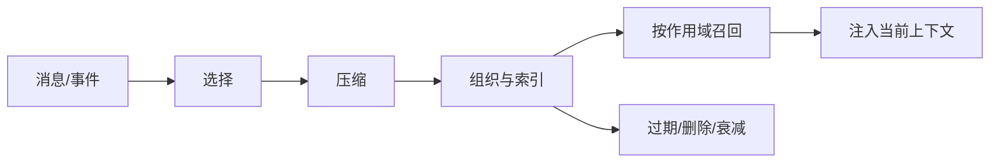

规则选择确定且便宜，覆盖有限；LLM 理解隐含偏好，却会误抽取或返回非法结构。只建向量索引简单；增加关键词和实体信号更稳健，却放大写入与一致性成本。

### 2.4 从业务约束推导系统不变量

应先定义六个不变量：作用域过滤先于相似度；原始证据与派生记忆可区分；创建、更新、事件与过期时间不混用；部分失败可观察和修复；删除覆盖派生副本；召回内容仍是不可信输入。

**教学实现。** 最小入口先验证 scope，再让后续策略执行。

**教学实现**
```python
def validate_scope(scope: dict[str, str | None]) -> dict[str, str]:
    keys = ("user_id", "agent_id", "run_id")
    clean = {}
    for key in keys:
        if scope.get(key) is None:
            continue
        value = scope[key].strip()
        if not value or any(char.isspace() for char in value):
            raise ValueError(f"invalid {key}")
        clean[key] = value
    if not clean:
        raise ValueError("at least one scope id is required")
    return clean
```

**Mem0 源码对照。** `mem0/memory/main.py::_validate_and_trim_entity_id()` 会把 ID 转为字符串、去除首尾空白，并拒绝空值、纯空白与内部空白；`_build_filters_and_metadata()` 将全部已提供 ID 同时加入写 metadata 和查询 filters，三者皆空则抛出 `Mem0ValidationError`。这落实 scoped 入口的查询构造，但不替代 API 鉴权，也不能保证自定义 Provider 的底层隔离。

**Mem0 源码**
```python
if not session_ids_provided:
    raise Mem0ValidationError(
        message="At least one of 'user_id', 'agent_id', or 'run_id' must be provided.",
        error_code="VALIDATION_001",
    )
```

### 2.5 本章练习与面试思考

**取舍。** 关系主库事务提交后异步建索引，恢复容易但搜索短暂最终一致；直接写多个存储部署轻，却需幂等、对账和补偿。保留 transcript 利于审计，也扩大隐私面。应从失败影响推导方案，而非从 Vector Store 反推需求。

1. **代码阅读题：** 同时给 `_build_filters_and_metadata()` 传 `user_id` 与 `run_id`，检查两个返回 dict；再定位无 scope 的错误路径。
2. **设计决策题：** “向量维度不一致导致写入失败”应只存情景记忆还是同时进 event log？比较真相源、审计和期限。
3. **面试题：** 用“什么值得记、如何表示、归谁、如何召回、何时遗忘”映射写策略、schema、隔离、索引和生命周期。

## 3. 记忆分类与设计选型 {#chapter-3}

### 3.1 按功能：工作、语义、情景与程序记忆

**直觉。** “正分析混合评分”服务当前任务；“默认 Python”是稳定事实；“曾因维度错误写入失败”是经历；“typecheck→test→build”是方法。

| 类型 | 回答的问题 | 案例 | 典型召回/寿命 |
|---|---|---|---|
| 工作 | 现在做什么？ | 当前分析任务 | Run 内直接读 |
| 语义 | 稳定事实是什么？ | 默认 Python | scope + 语义/精确；长期 |
| 情景 | 何时发生过什么？ | 维度故障与解决 | 时间/实体/语义；中长期 |
| 程序 | 应按什么步骤做？ | typecheck→test→build | Agent/任务；流程有效期 |

### 3.2 按归属：User、Agent、Run 与 Organization

**模型。** 归属回答“谁的未来行为能使用”，不是“谁说了话”。User 级存个人偏好，Agent 级存角色习惯，Run 级存任务状态，Organization 级存审核后的团队规范。当前 Python OSS 一等 scope 是 `user_id`、`agent_id`、`run_id`，可同时提供；没有等价 `organization_id` 参数。组织级即使放 metadata，也仍需应用层授权。

### 3.3 按表示：事件、摘要、原子事实、实体关系与步骤

事件保真但量大；摘要省 token 但难局部更新；原子事实易去重与召回但会丢语气；实体关系利于关联扩展但消歧昂贵；步骤保存顺序和前置条件。Mem0 当前自动推断主路径抽取新的原子记忆，实体随后写独立集合，以 `linked_memory_ids` 指回主记忆。提示词中的关联字段和实体索引是不同层，不能只凭 prompt 声称记忆图已持久化。

### 3.4 按生命周期：瞬时、TTL、长期、衰减与审计

**候选方案。** 瞬时状态随 Run 删除；TTL 是硬截止；长期记忆允许显式纠错；衰减降低排序权重；审计保留维护不可抵赖事件。它们不可互换。当前 OSS `expiration_date` 是日期，搜索与列表默认隐藏已过期记录；`timestamp` 被明确拒绝为 Platform-only temporal parameter，`_OSSProject.update(decay=True)` 也提示边界。因此不能声称本地 `Memory` 已有完整时间推理或衰减。

### 3.5 按检索：精确、向量、关键词、实体、图与混合检索

精确检索用于 ID 与强过滤；向量处理语义改写；BM25 保留错误码和专名；实体扩展关联；图适合多跳；混合检索融合信号。

**选择。** 必须先做 scope 精确过滤，再按查询特点组合信号。问“index size 报错”时，向量找相似故障，BM25 捕捉术语，实体提升 Qdrant/Embedding 关联。`VectorStoreBase.keyword_search()` 默认返回 `None`，统一方法名不保证具体 Provider 支持关键词检索。

### 3.6 选型矩阵与决策树

**数据流。** “功能 × 表示”是二维分类，约束再决定检索与生命周期。

| 功能 \ 表示 | 事件 | 摘要 | 原子事实 | 实体关系 | 步骤 |
|---|---|---|---|---|---|
| 工作 | 工具日志 | 任务摘要 | 当前约束 | 活跃组件 | 下一动作 |
| 语义 | 事实来源 | 画像摘要 | 默认 Python | 项目—存储 | — |
| 情景 | 故障时间线 | 复盘 | 曾发生错误 | 故障—组件 | 恢复步骤 |
| 程序 | 执行轨迹 | SOP 摘要 | 前置条件 | 工具依赖 | 有序流程 |

**概念伪代码（Mermaid）**
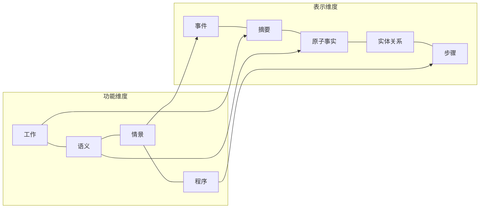

**概念伪代码（Mermaid）**
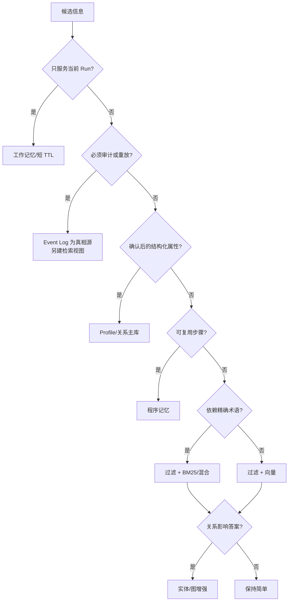

**教学实现。** 下例把一致性、解释性和寿命约束转成可测试选择，而不是用名词堆砌。

**教学实现**
```python
from dataclasses import dataclass


@dataclass(frozen=True)
class Constraints:
    run_only: bool = False
    audited: bool = False
    exact_terms: bool = False


def choose_design(c: Constraints) -> tuple[str, str]:
    if c.run_only:
        return "working", "ttl"
    if c.audited:
        return "event_log+derived_memory", "exact+semantic"
    return "atomic_fact", "hybrid" if c.exact_terms else "semantic"
```

### 3.7 Mem0 理论分类与当前 API 能力的差异

**Mem0 源码对照。** 枚举定义三种理论类型。

**Mem0 源码**
```python
class MemoryType(Enum):
    SEMANTIC = "semantic_memory"
    EPISODIC = "episodic_memory"
    PROCEDURAL = "procedural_memory"
```

`SEMANTIC` 表示可跨事件复用的事实，`EPISODIC` 表示经历，`PROCEDURAL` 表示步骤；但当前 OSS `add()` 不提供对称入口。

**Mem0 源码**
```python
if memory_type is not None and memory_type != MemoryType.PROCEDURAL.value:
    raise Mem0ValidationError(...)

if agent_id is not None and memory_type == MemoryType.PROCEDURAL.value:
    return self._create_procedural_memory(messages, metadata=processed_metadata, prompt=prompt)
```

显式传 `semantic_memory` 或 `episodic_memory` 会被拒绝；只有 `agent_id` 与 `procedural_memory` 同时存在才进入程序摘要分支。其他写入走通用抽取/直存路径；异步路径有对应分支。

### 3.8 本章练习与面试思考

**取舍。** 单集合加类型字段易运营但过滤要求高；按类型分集合可定制索引和 TTL，却增加跨类型召回。显式程序分支清晰，也容易让人误以为枚举能力对称，应用封装应保留自己的领域映射。

1. **代码阅读题：** 比较同步/异步 `add()` 的类型校验、procedural 条件和返回结构。
2. **设计决策题：** “Redis 改用 pgvector”应存事件、当前事实还是二者并存？说明真相源、时间和冲突召回。
3. **面试题：** 从功能、归属、表示、生命周期、检索五维说明分类如何改变 schema、索引、权限、TTL 与评估。

## 4. Mem0 的宏观架构 {#chapter-4}

### 4.1 Monorepo 地图

**直觉。** 搜到同名 `Memory` 就逐行读，会把本地 SDK、远程客户端和完整应用混在一起。先问算法在哪执行、状态在哪持久化、信任边界在哪。

**模型。** 本教程以 Python OSS `mem0/memory/main.py::Memory` 为主证据；`mem0/client/main.py` 只证明远程调用边界，不反推 Hosted Platform 内部。

| 路径 | 职责 | 关键边界 |
|---|---|---|
| `mem0/` | Python 本地 Memory、Platform client、Provider | 本地与远程入口并存 |
| `mem0-ts/` | TypeScript hosted client + OSS memory | 不假设内部与 Python 完全相同 |
| `server/` | 自托管 API 服务 | 不是 Hosted Platform 开源镜像 |
| `openmemory/` | FastAPI/MCP 后端 + Next.js UI | 有独立应用架构和迁移链 |
| `cli/python/`、`cli/node/` | 终端工作流 | 调用入口，不是算法真相源 |
| `integrations/` | Agent、编辑器与框架适配 | 决定何时调用核心能力 |
| `docs/` | API、概念、集成、迁移文档 | 版本行为仍需源码核对 |

**概念伪代码（Mermaid）**
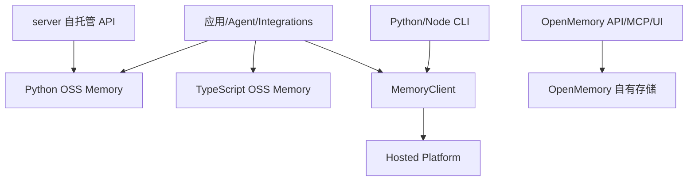

### 4.2 OSS Library、Server、OpenMemory 与 Platform

**候选方案。** Library 透明但由应用承担密钥与一致性；Server 集中 API/鉴权但增加网络运维；OpenMemory 提供 UI/MCP；Hosted Platform 降低运维但改变数据、成本和网络边界。

| 形态 | 执行/状态边界 | 接口 | 适用场景 |
|---|---|---|---|
| OSS Library | 应用进程；配置的 Vector Store + SQLite | `Memory` / `AsyncMemory` | 原型、嵌入式服务 |
| Self-Hosted Server | 自建容器与数据库 | HTTP API | 团队共享、集中治理 |
| OpenMemory | 自建完整应用 | UI、API、MCP | 可视化与 Agent 工具 |
| Hosted Platform | Mem0 托管边界 | Client/API | 零运维与平台能力 |

**选择。** 本文只解剖可复核的 OSS Library，不从 `Memory` 推断 Server/OpenMemory/Platform 内部能力。

### 4.3 Memory 的组件组合

**数据流。** `Memory` 协调 LLM 抽取/摘要、Embedder、主 Vector Store、可选 Reranker、SQLite history/recent messages 和惰性 Entity Store。

**概念伪代码（Mermaid）**
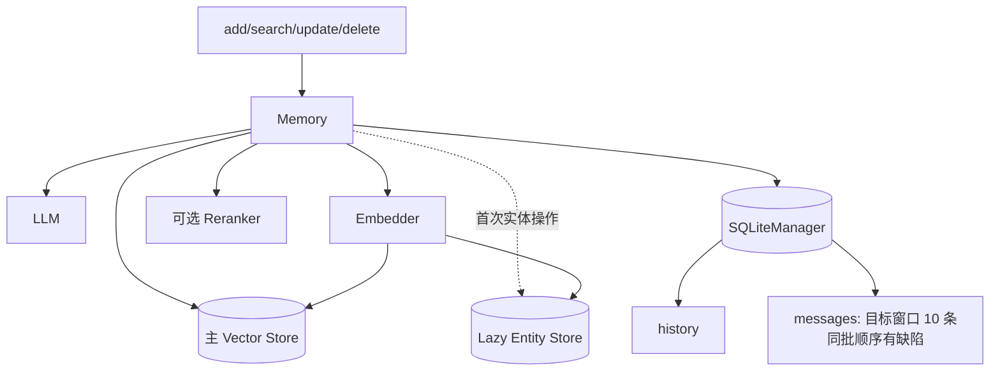

初始化时 `_entity_store = None`。自动写入会读取最近消息与主向量候选，抽取、Embedding、写主集合和 history，再 best-effort 建实体索引并保存最近消息；这些箭头跨多个故障边界。

### 4.4 Provider Factory 与依赖倒置

**教学实现。** 依赖倒置的核心是高层只依赖能力，由外部组合具体实现。

**教学实现**
```python
from dataclasses import dataclass
from typing import Protocol


class Embedder(Protocol):
    def embed(self, text: str, memory_action: str) -> list[float]: ...


@dataclass
class MemoryParts:
    llm: object
    embedder: Embedder
    vector_store: object
    reranker: object | None = None
```

**Mem0 源码对照。** `Memory.__init__()` 由配置调用 Factory，再创建 SQLiteManager。

**Mem0 源码**
```python
self.embedding_model = EmbedderFactory.create(
    self.config.embedder.provider,
    self.config.embedder.config,
    self.config.vector_store.config,
)
self.vector_store = VectorStoreFactory.create(
    self.config.vector_store.provider, self.config.vector_store.config
)
self.llm = LlmFactory.create(self.config.llm.provider, self.config.llm.config)
self.db = SQLiteManager(self.config.history_db_path)
```

若配置 reranker，再由 `RerankerFactory.create()` 创建。`MemoryConfig` 聚合 Vector Store、LLM、Embedder、可选 Reranker、history 路径、版本和自定义指令；当前默认 Vector Store 是 Qdrant，LLM/Embedder 是 OpenAI。

`LLMBase` 要求 `generate_response()`；`EmbeddingBase` 要求 `embed()`，默认 `embed_batch()` 逐条调用；`VectorStoreBase` 要求增删改查与集合管理，规定搜索分数越高越相似，`keyword_search()` 默认 `None`，`search_batch()` 默认逐条。Factory 统一创建，不抹平分数尺度、事务、批量和检索能力差异。

### 4.5 同步与异步接口

Python OSS 导出 `Memory` 与 `AsyncMemory`，Hosted 端导出 `MemoryClient` 与 `AsyncMemoryClient`。异步适合已有 event loop 和并发等待网络；同步适合脚本和简单任务。当前异步类有对应的初始化、惰性实体存储和 CRUD/history 路径，部分同步工作用 `asyncio.to_thread` 包装，因此 async 接口不保证每个 Provider 原生非阻塞，更不会把多存储操作变成事务。

### 4.6 本章练习与面试思考

**取舍。** 显式 Factory 映射可读、可控，但新增 Provider 要注册；动态插件发现更开放，也更难调试和治理。进程内组合最透明，服务化利于多语言与集中授权，托管降低运维；选择应由团队能力、数据边界和故障预算决定。

1. **代码阅读题：** 从 `Memory.__init__()` 画出四个 Factory 的输入输出，再读 `entity_store` property，说明 lazy 初始化和集合名派生。
2. **设计决策题：** 20 人团队让 Python、TS 和编辑器插件共享记忆，应选 Library 还是服务？比较鉴权、网络、升级和运维。
3. **面试题：** Provider Factory 解决什么、没解决什么？用 `VectorStoreBase.keyword_search()` 默认 `None` 解释能力差异。

## 5. 核心数据模型与系统不变量 {#chapter-5}

### 5.1 Message、Memory、Entity 与 History

**直觉。** “项目改用 pgvector”是 Message；抽取出的当前事实是 Memory；项目和 pgvector 是 Entity；更新旧 Redis 事实形成 History。它们分别承担证据、可用状态、关联入口和变更解释。

**模型。** `Memory.add()` 接受字符串、dict 或 `list[dict]`。Message 是 API 输入结构，不是当前 `mem0/configs/base.py` 中的持久化 Pydantic 类；`MemoryItem` 才是结果模型，含 id、memory、hash、metadata、score 和时间。主 Memory 的 Vector Store payload 用 `data` 存正文；Entity payload 含 `data`、`entity_type`、`linked_memory_ids` 与 scope；SQLite History 保存 old/new、event、时间、删除标志和 actor/role。

**概念伪代码（Mermaid）**
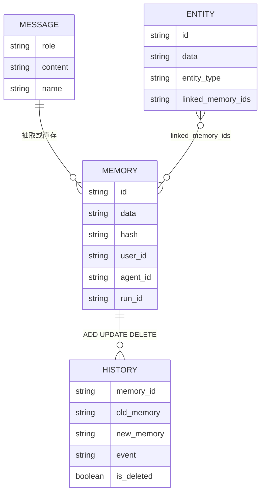

这是逻辑关系，不是外键图：实体引用与 SQLite history 都没有对主 Vector Store 的数据库外键。

### 5.2 user_id、agent_id、run_id 与 actor_id

**候选方案。** 单一 tenant key 简单但难跨 Run 聚合；多个 scope ID 做 AND 过滤表达力强，却要求调用方稳定传齐。当前 OSS 选择“至少一个、多个可并存”。

| 字段 | 回答的问题 | 当前行为 | 可替代 scope？ |
|---|---|---|---|
| `user_id` | 属于哪个用户空间？ | 一等 scope，进入 metadata/filters | 是一类 scope |
| `agent_id` | 属于哪个 Agent？ | 一等 scope；procedural 分支条件 | 是一类 scope |
| `run_id` | 属于哪次任务？ | 一等 scope，适合临时隔离 | 是一类 scope |
| `actor_id` | 哪位参与者产生原始记录？ | 可额外过滤；直存时来自 message `name` | 否，只能缩小 scope |
| `role` | 对话协议角色？ | 直存保存 user/assistant，跳过 system | 否 |
| `attributed_to` | 抽取事实描述 user 还是 assistant？ | LLM 返回时写主 payload | 否，是语义归因 |

**选择。** scope 决定可访问空间，actor/role 描述输入来源，attribution 描述事实对象。把 `role="user"` 当 `user_id` 会串租户；把 `attributed_to` 当 `agent_id` 会把语义归因误作授权。

### 5.3 内容、hash、关键词、向量、时间与元数据

| 字段 | 职责 | 边界 |
|---|---|---|
| `data` / API `memory` | 人可读正文 | 不是原始 transcript |
| MD5 `hash` | 完全文本去重 | 不是语义去重/安全签名 |
| `text_lemmatized` | BM25 规范化文本 | 不替代原文/向量 |
| vector | 语义近邻 | 不承担权限过滤 |
| `created_at` / `updated_at` | 创建/显式更新时间 | 不等于事件发生时间 |
| `expiration_date` | 到期后默认隐藏 | 不等于衰减/隐私擦除 |
| metadata | scope 与业务过滤 | 自由字段不天然保证授权 |

自动抽取路径用文本 MD5 与已有候选和当前批次去重，无法识别“默认用 Python”和“首选 Python”的语义等价。显式 update 会重算 hash、lemmatized text 和向量。OSS 接受日期型 `expiration_date`，拒绝 Platform-only `timestamp`，所以不能把自然语言时间等同于 `created_at`。

### 5.4 主集合、实体集合和 SQLite 辅助状态

**数据流。** 主向量、惰性实体集合、SQLite history/messages 是四块逻辑状态；即使 Qdrant embedded 共享 client，实体仍是独立集合。

**概念伪代码（Mermaid）**
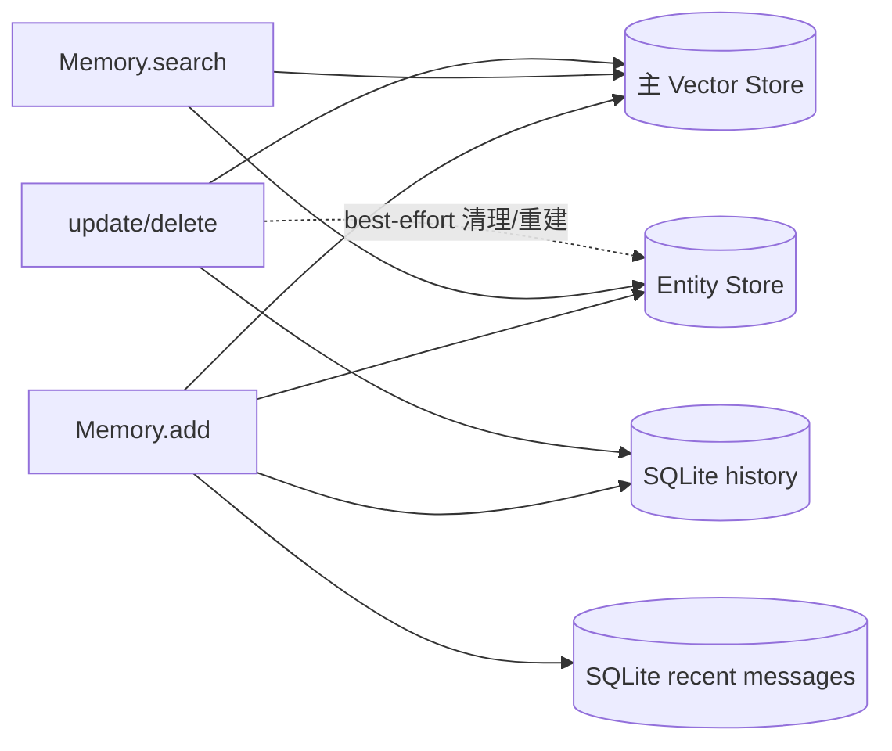

**关键不变量：四类状态没有共享事务。** 主 insert 后写 history，实体是 best-effort，messages 另开事务；会出现部分成功。接口须定义成功范围并支持对账。

### 5.5 多租户隔离与作用域不变量

**教学实现。** 授权必须先于搜索，可信 scope 不能由 prompt 覆盖。

**教学实现**
```python
def authorized_recall(principal, query: str, requested_scope: dict[str, str]):
    allowed_scope = authorize(principal, requested_scope)
    if not allowed_scope:
        raise PermissionError("scope is not authorized")
    return memory_search(query=query, filters=allowed_scope)
```

**Mem0 源码对照。** `_build_filters_and_metadata()` 要求 `user_id`、`agent_id`、`run_id` 至少一个，并将全部已提供 ID 同时用于写 metadata 和查询 filters。`actor_id` 查询优先级是显式参数，其次是 filters 中已有值；它不进入基础写模板。`_build_session_scope()` 排序拼接三个 scope ID，为最近消息形成稳定分区。`infer=False` 为非 system 消息保存 role，并在有 name 时保存 actor_id。

**Mem0 源码**
```python
for key in sorted(["user_id", "agent_id", "run_id"]):
    val = filters.get(key)
    if val:
        parts.append(f"{key}={val}")
return "&".join(parts)
```

多租户还需要 API 鉴权、领域授权和底层 Provider 正确执行过滤；本地 ID 校验只覆盖 scoped 查询构造。当前 OSS `add()`、`search()`、`get_all()`、`delete_all()` 有 scope 参数/过滤，但 `get(memory_id)`、`update(memory_id, ...)`、`delete(memory_id)`、`history(memory_id)` 是**直接 ID API**：它们不接收 scope，也不验证该 ID 是否属于当前主体。调用服务必须在进入这些 API 前完成鉴权与目标归属校验；“先 `get()` 再检查、随后 mutation”仍有 TOCTOU，不是原子授权。生产应采用 scope-aware 条件写/删，或在权威表事务中锁定并校验归属后更新，再异步同步索引。`actor_id` 只能缩小查询，不能扩大 scope。

**取舍。** scope 越细，泄漏半径越小，但跨项目学习需显式聚合。单库事务主表再异步索引易恢复但有新鲜度窗口；多 Provider + SQLite 灵活却依赖幂等、outbox/补偿和对账。组织共享记忆应审核写入，而非自动把任意对话升级为组织事实。

### 5.6 本章练习与面试思考

1. **代码阅读题：** 阅读 `SQLiteManager.save_messages()`，构造同批 12 条消息，说明为何只按同一 `created_at` 无法保证留下输入末 10 条。
2. **设计决策题：** 主向量成功、实体写失败时应返回成功、失败还是“待修复”？先定义实体是否为核心能力和重试幂等。
3. **面试题：** 用“访问空间—发送者—协议角色—事实对象”解释 `user_id`、`actor_id`、`role`、`attributed_to`。
4. **源码推演题：** 阅读 `_update_memory()`，列出文本变化时重算字段、actor 保留、history 与 entity cleanup 顺序及部分失败。

## 6. 写入生命周期：从对话到长期记忆 {#chapter-6}

### 6.1 写入前先定义不变量

**直觉。** 听到“默认用 Python”时，助手不应保存寒暄或暗改旧偏好；还要区分无事实、抽取故障和各存储结果。

**模型。** `消息 → scope 候选 → ADD 事实 → 主向量 → 辅助状态`。至少一个 scope；空抽取不等于 Provider 故障；多存储非原子。V3 是 **ADD-only**，不自动 UPDATE/DELETE。

**候选方案。** 原文直存噪声高；LLM 决定 CRUD 含破坏性动作；只抽新增事实再显式纠错，写放大较高但边界清楚。

**选择。** OSS 保留原文直存、程序摘要和默认 V3 批处理三路；下文以第三路为主。

### 6.2 Memory.add 的入口校验与三条分支

**数据流。** `Memory.add()` → `_build_filters_and_metadata()` → `_add_to_vector_store()`。入口处理时间字段、至少一个 scope ID 和消息列表规范化。

三条分支不能互相推断：

| 分支 | 处理方式 | 关键失败/返回 |
|---|---|---|
| `infer=False` | 跳过非法/`system` 消息，逐条 Embedding；保存正文、`role` 和可选 `actor_id` | 单条故障上抛；都是 `ADD` |
| `agent_id` + `procedural_memory` | LLM 总结成一条程序记忆 | 故障上抛；仅此 memory type 可显式传入 |
| 默认 `infer=True` | V3 分阶段批处理 | 单次抽取、批量降级、实体 best-effort；只有 `ADD` |

`semantic_memory`/`episodic_memory` 会报错；`infer=False` 仍需要 Embedder。

### 6.3 Phase 0-2：上下文、已有记忆与单次 LLM 抽取

Phase 0 按键名排序拼接 scope；`user_id="u1"`、`run_id="r7"` 得到稳定 key `run_id=r7&user_id=u1`。`SQLiteManager.save_messages()` **意图**按 key 只保留最近 10 条，`get_last_messages()` 也意图恢复时间正序；但一次 `save_messages()` 给整批消息写相同 `created_at`，裁剪和读取都只按 `created_at` 排序，没有 tie-break。因此单批 12 条时不能保证留下输入的第 3–12 条，也不能保证同批返回顺序；这是真实源码边界，而非“最后 10 条/正序”的契约。

生产/SDK 修复应保存单调 `sequence`/插入序并用 `(created_at, sequence)` 排序，或为每条消息生成有序时间。`(created_at, id)` 只有在 `id` 本身按输入顺序单调时才正确；当前随机 UUID 不表达输入顺序，最多提供任意的稳定全序。应补“单批超过 10 条”的回归测试，同时断言保留集合和时间正序。

Phase 1 在 scope 内语义搜索，固定 `top_k=10`。UUID 以小整数呈现给 LLM，并建反向 `uuid_mapping` 降低 ID 幻觉；后续主写未消费它。

Phase 2 只做一次 JSON LLM 调用；纯 agent scope 追加 agent 视角。解析失败再 `extract_json()`；空/最终解析失败/`memory=[]` 按无事实保存消息，Provider 异常提升为 `LLMError`。

### 6.4 Phase 3-6：批量 Embedding、hash 去重与持久化

Phase 3 对非空 `text` 做 batch Embedding，失败则逐条回退；仍失败的事实被跳过。Phase 4 用 lemma 生成 BM25 字段（spaCy 不可用则回退原文）。

Phase 5 用 `MD5(text)` 对 10 条旧候选和本批做**精确文本**去重；record 保存 UUID、正文、lemma、hash、scope、时间与归因。prompt 的 `linked_memory_ids` 未进主 payload。

Phase 6 的主 insert 与 `ADD` history 都批量优先、失败逐条回退。history 和返回值基于“计划 records”而非确认成功集合，故主记录失败时仍可能写 history、返回该 ID。

### 6.5 Phase 7-8：实体关联、最近消息与返回值

Phase 7 基于**全部计划 records** 批量抽取、去重并嵌入实体；先找精确匹配，再接受相似度 `≥0.95` 的匹配。它不知道 Phase 6 哪些逐条 insert 实际成功，因此可能写出指向主记录失败 ID 的 dangling entity links；整体 best-effort。

V3 prompt 的 `linked_memory_ids` 表示新旧 Memory 关联，但当前主路径不持久化它；真正写入的是 NLP 重抽实体后，在**独立实体集合**保存的 Entity→Memory 引用。两者不可混称 memory graph。

Phase 8 保存消息并返回计划 records；SQLite 失败上抛但不回滚先前主写。

**概念伪代码（Mermaid）**
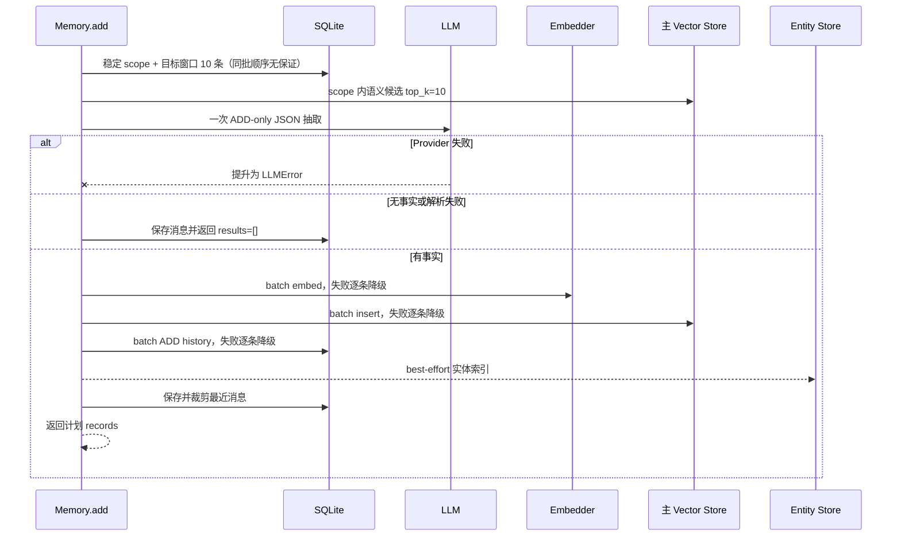

### 6.6 ADD-only 与手动 UPDATE/DELETE 并不矛盾

“以前默认 Python，现在明确要求 Rust”会作为新事实 ADD。应用确认冲突后再显式 `update()`/`delete()`；自动 supersede 也应由应用保存关系，不能假设 V3 会改写旧 ID。

### 6.7 部分失败、降级与一致性分析

| 故障点 | 行为与后果 | 恢复 |
|---|---|---|
| LLM Provider / JSON 失败 | 前者 `LLMError`；后者按空抽取 | 分开告警与重试 |
| batch Embedding | 逐条回退，仍失败则漏 record | 补偿队列 |
| batch insert | 逐条回退；返回可能多于主存 | read-after-write |
| history | 逐条回退；主记录可能无审计 | outbox |
| entity | best-effort；可能缺链接或产生 dangling link | 重建索引 |
| messages | SQLite 回滚上抛；主存可能成功 | 幂等对账 |

这是**非原子 best-effort 多写**，不是事务，也不能仅凭调用结束称为最终一致性：源码没有内建 retry、outbox 或 reconciliation，不保证状态会自动收敛。只有应用增加幂等重试、主存确认、对账和实体重建后，才可把整套系统设计为 eventual consistency；history 是否为硬条件仍由合规策略定义。

### 6.8 教学伪代码与 Mem0 源码对照

**教学实现。** 改进接口只返回确认成功 ID；这不是当前结构。

**教学实现**
```python
def persist_individually(records, insert_one) -> tuple[list[str], list[str]]:
    persisted, failed = [], []
    for memory_id, vector, payload in records:
        try:
            insert_one(memory_id, vector, payload)
            persisted.append(memory_id)
        except Exception:
            failed.append(memory_id)
    return persisted, failed
```

**Mem0 源码对照。** Provider 故障被提升；payload 只读取 `text` 和 `attributed_to`。

**Mem0 源码**
```python
try:
    response = self.llm.generate_response(...)
except Exception as e:
    raise LLMError(f"LLM extraction failed: {e}") from e

mem_metadata["data"] = text
if mem.get("attributed_to"):
    mem_metadata["attributed_to"] = mem["attributed_to"]
```

**取舍。** 批量回退模糊全批成功；ADD-only 累积冲突；实体 best-effort 可静默降质。需补 per-record 状态、幂等与重建。

### 6.9 本章练习与面试思考

1. **代码阅读题：** 沿三条 add 分支列出 LLM、Embedding、主存和 SQLite 调用。
2. **设计决策题：** 某 record insert 失败时，设计返回、补偿与幂等策略。
3. **面试题：** 为什么解析失败的空列表仍不同于 Provider 失败？

## 7. 检索生命周期：从查询到排序结果 {#chapter-7}

### 7.1 查询校验、作用域与高级过滤

**直觉。** 问“上次 Qdrant index size 报错怎么解决”时，语义、关键词和实体各有盲区，而且必须先限定可信 user/run scope。

**模型。** 流程是 `scope → 语义候选 → 同 ID 的 BM25/实体信号 → 排序 → 可选 reranker`；候选全集由语义搜索决定。

**候选方案。** 加权相加可解释；RRF 抗尺度差；LTR 有表达力但需标注；reranker-only 简单却救不回漏召回。

**选择。** OSS 先语义过量召回，再按 ID 加 BM25/entity。高级 filters 的实际能力取决于 Provider。

query trim 后须非空，`threshold∈[0,1]`，`top_k` 是非负非 bool 整数；三个 scope ID 至少一个且必须放 filters。例如 `filters={"user_id": "u1", "AND": [{"project": {"eq": "mem0"}}, {"priority": {"gte": 2}}]}` 表示先限定用户空间，再以 project 与 priority 元数据继续收窄；scope 与这些条件组合，而非被 prompt 替换。协调层会转换 AND 与比较操作，但具体 Provider 能否忠实实现 `gte`、OR/NOT、`contains` 等仍须查其过滤适配并做集成测试。

### 7.2 查询预处理、Embedding 与过量召回

**数据流。** 原文用于 Embedding，lemma 用于 BM25，实体用于关联增益。两路召回上限是：

\[
L_{internal}=\max(4\times top\_k,\ 60)
\]

主向量与关键词搜索都用 `internal_limit`。Provider 未覆盖 `keyword_search()` 时返回 `None`，BM25 关闭；最终 candidates 仍只来自 semantic results。

评分前先过滤 `expiration_date < UTC today`（等于今天可见），再执行 `semantic_score < threshold`；BM25/entity 都救不回被剔除者。

**概念伪代码（Mermaid）**
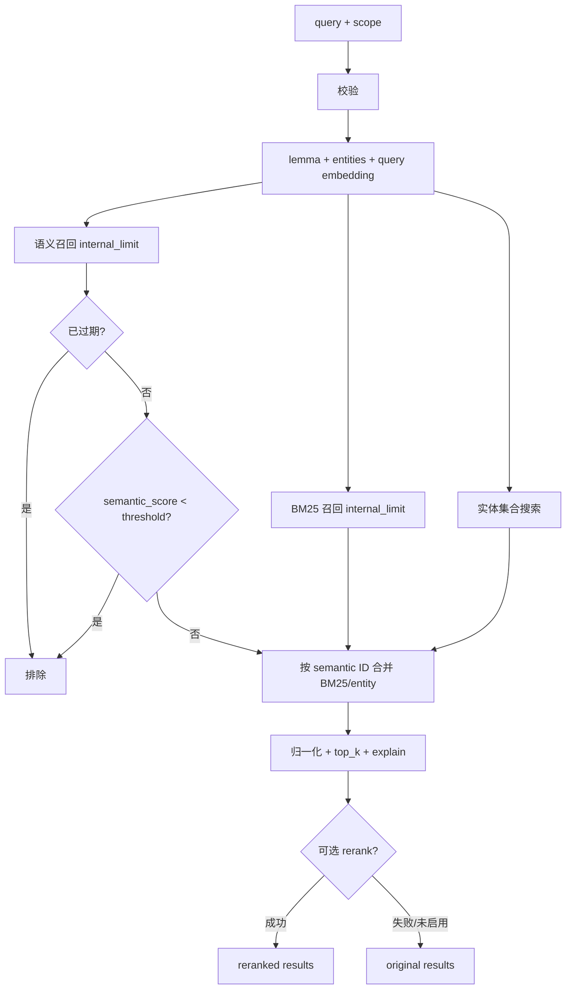

### 7.3 BM25 归一化

BM25 raw 无固定上界。按 lemma term 数选择 sigmoid `(m,k)`：`≤3:(5,.7)`、`≤6:(7,.6)`、`≤9:(9,.5)`、`≤15:(10,.5)`、否则 `(12,.5)`；仅正分进入映射：

\[
bm25_{norm}=\frac{1}{1+e^{-k(raw-m)}}
\]

中点输出 0.5；这些是工程校准参数，不是概率。

### 7.4 实体索引与关联记忆增益

实体只取前 8 个并规范化去重，再 batch Embedding；数量错配则整路跳过。每实体并发搜索 `top_k=500`，相似度 `<0.5` 忽略。

实体记录含一组 `linked_memory_ids`。对每个命中的实体，设链接数为 \(n\)，稀释权重和 boost 为：

\[
w(n)=\frac{1}{1+0.001(n-1)^2},\qquad
entity\_boost=similarity\times 0.5\times w(n)
\]

同一 Memory 多次命中取最大 boost。`n=1` 权重为 1，`n=101` 约为 `1/11`，可抑制高连接实体。

### 7.5 融合公式、阈值和候选池限制

设某个语义候选为 \(d\)，当前精确公式是：

\[
raw(d)=semantic(d)+normalized\_bm25(d)+entity\_boost(d)
\]

\[
max\_possible=1.0+\mathbb{1}_{BM25\ active}\times1.0+\mathbb{1}_{entity\ active}\times0.5
\]

\[
final(d)=\min\left(\frac{raw(d)}{max\_possible},1.0\right)
\]

“active”是**查询全局**状态：`score_and_rank()` 在候选循环外用 `bool(bm25_scores)` / `bool(entity_boosts)` 固定一次分母。某候选缺少 keyed 分数时该项取 0，但仍使用同一全局分母。数值例：4-term query 得 `(m,k)=(7,.6)`；A 的 semantic=`.72`、raw BM25=`9`，规范后 `.769`；实体 similarity=`.8`、`n=1`，boost=`.4`。两路 active，分母 `2.5`：

\[
final_A=(0.72+0.769+0.4)/2.5\approx0.756
\]

若 threshold=`.75`，A 在相加**前**因 `.72 < .75` 被排除：语义候选/阈值先于 BM25/实体融合。

**教学实现。** 这个可运行函数只复现评分门控，不实现 Provider 搜索。

**教学实现**
```python
def hybrid_score(semantic, bm25, entity, threshold, *,
                 has_bm25: bool, has_entity: bool):
    if semantic < threshold:
        return None
    raw = semantic + (bm25 or 0.0) + (entity or 0.0)
    maximum = 1.0 + (1.0 if has_bm25 else 0.0)
    maximum += 0.5 if has_entity else 0.0
    return min(raw / maximum, 1.0)


assert round(hybrid_score(0.72, 0.769, 0.4, 0.1,
                          has_bm25=True, has_entity=True), 3) == 0.756
assert hybrid_score(0.72, None, None, 0.1,
                    has_bm25=True, has_entity=True) == 0.288
```

### 7.6 explain 与可选 reranker

**Mem0 源码对照。** `explain=True` 公开 semantic/BM25/entity、raw、上界、final 和 threshold。融合截断后才可选 rerank；失败 warning 并回退原结果。

**Mem0 源码**
```python
semantic_score = result.get("score") or 0.0
if semantic_score < threshold:
    continue
raw_combined = semantic_score + bm25_score + entity_boost
combined = min(raw_combined / max_possible, 1.0)
```

reranker 只接收融合后的 top_k，无法找回候选、过期或 threshold 阶段丢掉的记录。

### 7.7 真正多路召回与当前实现的对照

| 方案 | 候选 | 优点 | 取舍 |
|---|---|---|---|
| 当前加权相加 | 仅语义 | 快、可解释 | 精确词不能独立召回 |
| RRF | 多路并集 | 抗分数量纲 | 丢分差、需调常数 |
| Learning-to-rank | 多路并集 | 学习任务权重 | 需标注与漂移治理 |
| reranker-only | 前置单路 | 统一精排 | 漏召回不可恢复、成本高 |

真正多路召回应取三路 ID 并集；当前 BM25/entity 只给 semantic IDs 加分。

**取舍。** 加法易解释但需校准；阈值前置会误杀词法强结果。应分开评估候选、阈值、信号与 reranker。

### 7.8 本章练习与面试思考

1. **代码阅读题：** 沿 `_search_vector_store()` 标出过期过滤、语义阈值、BM25/entity 合并和 top-k 截断的精确顺序。
2. **设计决策题：** 错误码漏召回时，比较降 threshold、BM25 并集与 reranker。
3. **面试题：** 为什么 reranker 不是召回器？explain 如何支持治理？

## 8. 更新、遗忘、过期和历史 {#chapter-8}

### 8.1 新事实、冲突事实与显式更新

**直觉。** “默认 Python”变成“只用 Rust”既可是新事件，也可是纠错；覆盖会丢变化，追加会保留冲突。

**模型。** 教学状态为 Active、Superseded、Expired、Deleted。OSS 没有 superseded/deleted 主 payload flag：前者属应用关系，expired 由日期推导，delete 物理删除主向量而 history 可留痕。

**候选方案。** 追加保留事件，update 保持 ID，supersede 关系最清楚但需额外 schema 与过滤。

**选择。** V3 自动 ADD；确认后才显式 update/delete。当前配置应以配置库为准，演变史则追加并由应用记录 supersedes。

### 8.2 update 的重算范围

**数据流。** update 至少给 text、metadata 或 expiration；`data` 旧别名会 warning。缺 ID 报 `ValueError`，底层 get 故障原样上抛。入口只有 `memory_id`，没有 scope/主体参数；以下重算流程不是授权检查。

payload 合并旧值与 metadata，重算向量、MD5 hash、lemma，保留 `created_at`、刷新 `updated_at`。仅更新 metadata 也重算正文向量；已有 `actor_id` 强制保留，调用者不能覆盖。

主更新后写 `UPDATE` history。正文变化才调用旧实体清理再链接新实体，但 `_remove_memory_from_entity_store()` 在当前实例 `_entity_store is None` 时直接返回；随后的新实体链接会惰性初始化集合，却不会补做旧引用清理，因此跨实例复用实体集合时可能遗留旧正文的链接。即使 store 已初始化，单项异常也会被吞掉。顺序是主存→history→best-effort entity，无跨存储回滚。

**教学实现。** 显式确认纠错：

**教学实现**
```python
def confirm_correction(memory, old_id: str, new_text: str) -> None:
    memory.update(old_id, text=new_text)
```

### 8.3 delete、delete_all 与 reset

`delete(id)` 依次删除主向量、写 `DELETE` history（`new_memory=None, is_deleted=1`）、调用 best-effort 实体清理；它与 `get(id)`、`update(id)`、`history(id)` 一样仅凭 ID，不核验调用主体或 scope。history 失败时主向量已删。若当前实例从未初始化 entity store，cleanup 直接返回，可能完全不触碰底层已有实体集合并留下 dangling link。

`delete_all()` 要 scope，却只调用一次 `vector_store.list(filters=filters)` 再逐条删除；Provider 默认页可能漏删，Qdrant 当前默认最多 100 条。生产应分页到空、记录计数并 read-after-delete。

无 scope 的全局入口是 `reset()`：清 SQLite、重建主集合，但只在当前实例已初始化 `_entity_store` 时 reset 实体；旧进程留下而本实例未初始化的实体集合不会被触碰。

### 8.4 expiration_date 与查询时过滤

OSS 的 `expiration_date` 只有日期粒度：add 规范 `date`/`datetime`/`YYYY-MM-DD`，update 可设置或以 `None` 清除。search/get_all 默认隐藏早于 UTC today 的记录，`show_expired=True` 可见；等于今天未过期。

Expired 仅是查询时过滤，不物理删除向量、history/entity，也无后台 TTL。隐私擦除需另建清理作业覆盖派生副本与备份。

### 8.5 历史审计与物理删除的冲突

history 保存 ADD/UPDATE/DELETE 的 old/new；主向量删除后仍可读 DELETE 轨迹，所以删主存不等于删尽正文。

GDPR 风格擦除与审计保留是政策选择：需定义正文、最小审计元数据、实体、日志和备份期限。Mem0 不保证法规意义的全面擦除或不可变审计，`delete()`/history 不能当合规认证。

### 8.6 OSS 与 Platform 时间能力边界

**Mem0 源码对照。** OSS 拒绝 add 的 `timestamp`、search 的 `reference_date`，`project.update(decay=True)` 也报 Platform 能力提示；只支持 date-only `expiration_date` 过滤。不能宣称 OSS 有 temporal reasoning、reference-date search 或 decay，也不能从此反推 Platform 内部。

**Mem0 源码**
```python
if timestamp is not None:
    raise ValueError(get_temporal_feature_error_message("sync", "add", "timestamp"))
if reference_date is not None:
    raise ValueError(get_temporal_feature_error_message("sync", "search", "reference_date"))
```

### 8.7 生命周期状态图

**概念伪代码（Mermaid）**
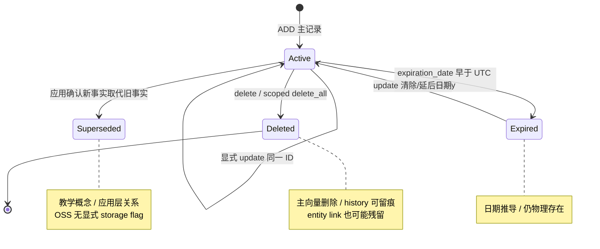

四者是**教学概念**，不是当前枚举/同表 flags；仅 history 行有 `is_deleted` 删除事件标记，图中的 Deleted 只保证主向量删除，不代表所有派生副本清空。

**取舍。** update 简化查询但隐藏演变；supersede 保留证据但需过滤；过期可预测但不擦除。删除与审计的平衡来自数据政策。

### 8.8 本章练习与面试思考

1. **代码阅读题：** 追踪 update 的主存、history、entity 顺序及 `_entity_store is None` 分支，并确认 direct-ID 入口没有 scope 校验。
2. **设计决策题：** 为“删除某用户全部偏好”设计分页直到空、计数验证、entity/history/backup 策略，并定义部分失败时是否返回成功。
3. **面试题：** `delete_all()` 与 `reset()` 为何分开？ADD-only 与 supersede 如何处理冲突？

## 9. 从零实现一个最小记忆系统 {#chapter-9}

`examples/memory_system_design_demo.py` 是标准库教学引擎；V0–V4 逐步增加不变量。

### 9.1 V0：保存全部消息

**直觉。** 先让系统记住，再讨论记得是否正确。

**模型（数据模型变化）。** V0 只有 `list[str]`，没有 ID、作用域或派生字段。

**候选方案。** 可保存全文、固定窗口或摘要；前两者可逆，摘要会丢证据。

**选择。** 追加全部消息作为基线。**解决的问题：**下一轮能读取旧消息。

**数据流。** `message → append → list`；读取时只能遍历全部内容。

**教学实现**
```python
messages_v0: list[str] = []


def remember_v0(message: str) -> None:
    messages_v0.append(message)
```

**Mem0 源码对照。** V0 没有一一对应物。`Memory.add(..., infer=False)` 会将每条非 system 原始消息 embed 后经 `_create_memory()` 写为 vector memory，并直接返回；这个 early return **不调用** `SQLiteManager.save_messages()`。recent messages 只在 infer 管线维护，是供抽取使用的短窗口上下文。两者都保留原始消息，除此之外不是同一路径。

**取舍。** 实现最透明；**剩余失败：**线性增长、重复、串线和全表扫描。

### 9.2 V1：抽取原子事实

**直觉。** 长期有用的是“偏好 Python”，不是产生它的整段寒暄。

**模型（数据模型变化）。** 输入变为 `MemoryInput`，存储变为带 `id`、`content_hash` 的 `MemoryRecord`。

**候选方案。** 原文最完整，摘要更短，原子事实最适合独立检索与更新。

**选择。** 调用者先给出事实，再逐条写入。**解决的问题：**事实可独立去重和检索。

**数据流。** `facts → MemoryInput → normalize → MD5 → MemoryRecord`；demo 在 scope 与 hash 相同且旧记录在 `now` 尚未过期时复用记录。

**教学实现**
```python
def remember_v1(engine: MemoryEngine, facts: list[str], scope: Scope) -> list[str]:
    return [engine.add(MemoryInput(text=fact), scope).id for fact in facts]
```

**Mem0 源码对照。** 对应 `Memory.add()`、V3 extraction prompt、`_add_to_vector_store()`、`_create_memory()` 的 payload `data`/`hash`。自动推断是 ADD-only；demo 自身没有 LLM 抽取器，`facts` 由调用者提供。demo 的过期感知去重是教学策略，不是 Mem0 当前 MD5 去重的完整复刻：OSS add 的 10 条现有候选未在该路径先做 expiration 过滤，过期同文仍可能阻止新增。

**取舍。** MD5 仅做规范化文本的 scope 内精确去重，不是语义去重或权限机制；跳过过期记录能重新 add，却保留旧物理记录。**剩余失败：**同义改写、否定、归因、冲突和过期清理仍由上游处理。

### 9.3 V2：作用域、Embedding 与语义检索

**直觉。** 事实变短后仍需先隔离所有者，再按查询相关性找回。

**模型（数据模型变化）。** 记录增加 `Scope(user_id, agent_id, run_id)`、`vector`、`keywords` 与时间；ID 会去除首尾空白，拒绝空值/纯空白/内部空白，且至少一个必填，与 OSS 校验边界一致。

**候选方案。** 精确匹配简单但漏同义表达，真实 Embedding 较强但引入网络与非确定性，哈希桶适合测试。

**选择。** 用确定性向量复刻检索形状。**解决的问题：**scope 隔离、top-k 和可重复实验。

**数据流。** `Scope.contains()` 先过滤，查询与记录向量算 cosine，低于 threshold 淘汰，再排序截断；`None` 是 scope 维度通配，但不代替鉴权。

**教学实现**
```python
scope = Scope(user_id="alice")
engine = MemoryEngine(embedder=DeterministicEmbedder(dimensions=64))
engine.add(MemoryInput("User prefers Python examples"), scope)
hits = engine.search("Python examples", scope, threshold=0.10, top_k=5)
```

**Mem0 源码对照。** 对应 `Memory.search()` filters、`_search_vector_store()`、`embedding_model.embed()` 与 Vector Store `search()`；`Scope.contains()` 只是 filters 的内存简化。

**取舍。** `DeterministicEmbedder` 将 token 的 SHA-256 映射到固定桶并归一化，只是**确定性词法教学模型**，没有真正语义能力；**剩余失败：**同义词、中文分词、跨语言、碰撞与阈值校准。

### 9.4 V3：关键词、实体与融合评分

**直觉。** 专有名词可能语义分一般，却有很强的精确词或实体证据。

**模型（数据模型变化）。** 记录增加 `keywords`、`entities`；结果变为 `SearchHit`，`ScoreDetails` 暴露各路分数。

**候选方案。** 可只用向量、让关键词独立召回，或在语义候选上融合；demo 选择最后一种以保持最小。

**选择。** 加入词重合和实体 boost。**解决的问题：**精确词与实体改善候选排序。

**数据流。** 先以 semantic threshold 门控；关键词分为 `|query ∩ record| / |query|`，实体交集加 `0.5`，再用 `(semantic + keyword + entity) / max_possible` 归一化并按 `(-score, id)` 排序。

**教学实现**
```python
hits = engine.search(
    "Which vector database does Mem0 use? Qdrant",
    Scope(user_id="alice"),
    query_entities=("Mem0", "Qdrant"),
    threshold=0.10,
    explain=True,
)
```

**Mem0 源码对照。** 对应 `lemmatize_for_bm25()`、`VectorStoreBase.keyword_search()`、`_compute_entity_boosts()`、`normalize_bm25()` 与 `score_and_rank()`；demo 的词重合并非 BM25。

**取舍。** 融合可解释但候选仍只来自语义通道；**剩余失败：**regex 忽略词频和语言学、实体由调用者提供，关键词不能救回阈值下候选。

### 9.5 V4：历史、更新、过期与冲突

**直觉。** 记忆会失效、被纠正或删除，只有当前值不足以解释变化。

**模型（数据模型变化）。** 记录增加 `created_at`、`updated_at`、`expires_at`；`MemoryEngine.events` 追加 ADD/UPDATE/DELETE 的 old/new。

**候选方案。** 可覆盖、只追加，或主记录加事件日志；最后一种兼顾当前读取与变化轨迹。

**选择。** 显式 update/delete 并保留 history。add 去重忽略 `expires_at < now` 的旧记录，故过期同文会获得新 ID、新 TTL 和新的 ADD history；旧记录保留用于教学观察。`expires_at == now` 仍未过期并继续去重。**解决的问题：**过期后可重新激活同文、支持纠错和追踪；冲突由应用确认后 update 或并存。

**数据流。** search 先跳过 `expires_at < now`；update 保留 ID/创建时间并重算向量、关键词、hash；delete 移除主记录但追加 DELETE event。

**教学实现**
```python
record = engine.add(MemoryInput("Project uses Redis"), Scope(user_id="alice"))
engine.update(record.id, text="Project uses pgvector", entities=("pgvector",))
audit_trail = engine.history(record.id)
engine.delete(record.id)
```

**Mem0 源码对照。** 对应 `Memory.update()`/`delete()`/`history()`、payload `expiration_date`、SQLite `history` 表及 `SQLiteManager.add_history()`/`get_history()`；OSS 为 UTC 日期粒度，demo 为 `datetime`。这里的过期感知 add 去重是刻意修正的教学策略，当前 OSS 不保证该行为。

**取舍。** 当前值易读且事件可审计；保留旧过期记录会增长存储，需后台回收。**剩余失败：**重启即丢、主记录与事件无事务，也无版本、并发控制、级联删除或法规级擦除；hash 不识别冲突。

### 9.6 教学实现与 Mem0 的符号对照

| 教学符号 | 教学职责 | Mem0 当前对应 | 不能等同之处 |
|---|---|---|---|
| `Scope` / `contains()` | user/agent/run 隔离 | Mem0 filters、`_build_filters_and_metadata()` | Provider 过滤更丰富；授权在应用层 |
| `MemoryRecord` | 正文、向量、hash、scope、时间 | Vector payload / `MemoryItem` | `MemoryItem` 无向量，schema 不等同 |
| `MemoryEngine.events` | ADD/UPDATE/DELETE 日志 | SQLite `history` 表 + `SQLiteManager.add_history()` / `get_history()` | 与主存无共享事务，非合规账本 |
| 教学 scoring | cosine、词、实体、归一化 | `score_and_rank()` | Mem0 使用 semantic candidates、BM25 和实体索引分数 |
| `update/delete/history(id)` | 可信内部教学操作 | OSS 同名 direct-ID API | 都不验证 scope；不可直接暴露为多租户外部 API |

crosswalk 只映射职责。demo 的 update/delete/history 是可信内部教学接口；跨用户 search 测试只证明查询过滤，**不能证明 ID-only mutation 安全**。外部服务须用 scope-aware 条件 mutation，或在权威表事务中鉴权并校验归属；非原子的“先 get 再 check”不是安全边界。生产还缺抽取质控、持久化、事务/补偿、并发幂等、Provider 降级与评测监控。

### 9.7 运行确定性演示

从仓库根目录运行；默认 embedder 不联网，输出各路分数。

**教学实现**
```bash
conda run -n mem0 python examples/memory_system_design_demo.py
```

测试命令是 `conda run -n mem0 python -m pytest tests/examples/test_memory_system_design_demo.py -q`；它验证教学不变量，不代表生产质量。

### 9.8 可选实验：替换为 DeepSeek 与 Qdrant

这是**可选实验**。先启动 Qdrant 并安装依赖；DeepSeek 密钥只读环境变量，绝不提交。

**教学实现**
```python
import os

deepseek_api_key = os.getenv("DEEPSEEK_API_KEY")
if not deepseek_api_key:
    raise RuntimeError("DEEPSEEK_API_KEY is required for this optional experiment")

from mem0 import Memory

config = {
    "llm": {"provider": "deepseek", "config": {
        "model": "deepseek-chat", "api_key": deepseek_api_key}},
    "embedder": {"provider": "huggingface", "config": {
        "model": "multi-qa-MiniLM-L6-cos-v1"}},
    "vector_store": {"provider": "qdrant", "config": {
        "host": "localhost", "port": 6333, "embedding_model_dims": 384,
        "collection_name": "memory_tutorial"}},
}
memory = Memory.from_config(config)
```

固定输入、scope、top-k，记录抽取、延迟与漏召回。真实模型不能与词法分数横比；Provider 仍会失败。

### 9.9 本章练习与面试思考

1. **代码阅读题：** 标出 scope、过期、threshold 顺序，再比较 direct-ID CRUD 为何没有同样的隔离证明。
2. **实现题：** 增加 `idempotency_key`，写出并发 add 的不变量。
3. **设计决策题：** 合并 semantic/BM25 候选，并处理主存成功、history 失败。
4. **面试题：** 为何确定性 embedder 不能证明语义能力？如何用 Recall@k、MRR 评测？

## 10. 工程化与生产设计 {#chapter-10}

### 10.1 幂等、并发与重复写入

生产要求同一来源事件、抽取版本和 scope 至多产生一组逻辑事实。用 `tenant + scope + source_event_id + extractor_version` 生成 `idempotency_key`，事实以 ordinal/稳定 key 建唯一约束；消费者租约领取 `PENDING`，CAS 提交 `COMMITTED`，update 带版本。文本 MD5 不识别同义改写，也没有跨进程唯一性。

### 10.2 原子性、补偿与最终一致性

先定义主记忆是否为真相源、history 是否强制、entity 是否可重建。当前是多存储 best-effort；只有应用补上幂等重试、补偿、read-after-write 与对账后，才是会收敛的 eventual consistency。

| 故障点 | 当前行为 | 用户可见效果 | 一致性风险 | 重试安全性 | 更强生产方案 |
|---|---|---|---|---|---|
| LLM 限流/超时；非法 JSON | Provider 异常提升为 `LLMError`；最终解析失败按空抽取并保存消息 | 前者失败，后者像“无事实” | 漏记且两类故障可能监控不足 | 重调 LLM 可能得到不同事实 | 区分 `NO_FACT`/`PARSE_ERROR`，保存原事件，以 idempotency key 重放并校验 schema |
| batch Embedding | 整批异常逐条回退；短返回会被 `zip` 截断 | 返回记录数减少 | 同批事实不完整 | 无唯一键时重试可能重复成功项 | 记录逐项状态、限定退避与 DLQ，按 logical ID upsert |
| 主 vector insert | batch 失败后逐条；单条失败只记日志，后续仍按计划 records 写 history/entity/返回 | API 可能返回实际不可检索 ID | orphan history、dangling entity | 仅凭随机 ID/MD5 不安全 | 权威表事务 + outbox；索引按固定 ID upsert，确认后才返回 |
| history insert | batch 失败后逐条；失败不回滚主记忆 | 记忆可搜但历史缺口 | 审计不完整 | 随机 history ID 重放会重复 | 与权威记录同事务写不可变事件，或唯一 operation ID + 对账 |
| entity insert/update | 异常捕获后继续；insert/外围失败 warning，单项 update 仅 debug | 实体增强静默降质 | 缺链接、重复实体或 dangling link，可观测性不足 | union 有一定幂等性，但并发读改写不安全 | 定义为派生索引并版本化重建；CAS/upsert 与孤儿扫描 |
| reranker | 捕获异常并回退融合结果 | 排序质量下降、仍有结果 | 无持久一致性风险 | 查询重试安全 | 熔断、超时、fallback 指标；保留融合分与 rerank 版本便于回放 |

主写失败应阻止辅助索引确认；合规 history 失败保持 `PENDING`，entity 失败标 `DEGRADED` 后重建。删除须分页到空并覆盖所有副本。

### 10.3 批处理、重试、降级和背压

批量使成功变成逐项状态。只重试超时、429、可恢复 5xx，退避加 jitter/总时限；schema/维度错入 DLQ。以 tenant 配额、积压和 token 背压，高水位暂停低价值抽取但保留原事件。检索可降级 reranker→entity→BM25→semantic，授权、过期和安全检查不可降级。

### 10.4 成本、延迟与容量规划

设每天 $W$ 个来源事件，每个抽取 $F$ 条事实、$E$ 个实体，维度 $D$、保留 $T$ 天、索引放大 $a$、batch 上限 $B$。主记录 $N\approx WFT$，存储粗估 $N\times(4D\times(1+a)+payload\_bytes)$；LLM extraction 约 $W$ 次。当前 SDK batching 只在单次 add 内：查询 `embed()` 约 $W$ 次，事实/entity 非空时各约 $W$ 次 `embed_batch()`；默认 batch 又逐条调用 `embed()`，Provider 请求可接近 $W+WF+WE$。只有跨事件 micro-batch 才近似 $W+\lceil WF/B\rceil+\lceil WE/B\rceil$。

search 的语义/BM25 上限均为 $R=\max(4k,60)$；entity 最多 8 路、每路 500，且只 boost 语义候选。阶段预算可串行相加、并行取较大值并留 queue 余量，但端到端 p95 必须由 trace/压测测量，不能把各阶段 p95 直接相加。例：$W=10^6,F=2,D=1536,T=365,a=1,payload=1KB$，约 7.3 亿记录、9.5TB，未含副本/history。

### 10.5 多租户、分片与索引迁移

tenant 来自认证主体，scope 只能收窄。小租户共享集合；大租户独立 shard，热点再按 user hash 拆分。配额覆盖 QPS、事实、token、候选和 entity fan-out。

Embedding 维度或 schema 变化时建 `index_v2`：从权威事件回填，以 logical ID 双写；shadow read 达标后切读，再停旧写。禁止混维度；对账期望与实际 ID 集。

### 10.6 隐私、安全与可观测性

密钥由 secret manager/环境注入且只读；日志不打印环境值、prompt 或配置 dump。内容需分类、最小保留、加密和授权，召回按不可信输入处理。观测阶段状态、解析错、orphan/dangling、scope 拒绝、质量、分位延迟、token/成功成本，以 idempotency key 串 trace。

### 10.7 同步 SDK、异步 SDK 与服务化

| 形态 | 优点 | 主要代价 | 适用 |
|---|---|---|---|
| 本地同步/异步 SDK | 透明、少一跳 | 各应用持密钥、版本漂移；async 可能 `to_thread` | 单团队、低规模 |
| 共享 memory service | 集中鉴权、配额，多语言复用 | 网络延迟、共享故障域 | 多团队在线读写 |
| 事件驱动 pipeline | 削峰、重放、补偿 | 新鲜度窗口、运维复杂 | 高吞吐、异步记忆 |

**概念伪代码（Mermaid）**
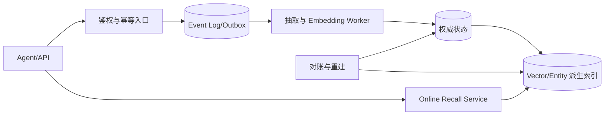

### 10.8 本章练习与面试思考

1. 为重复 webhook 写出 key、状态机、唯一约束和重放。
2. 任选 history/entity 为硬/软依赖，说明返回码、补偿与 SLO。
3. 用实际 QPS、F、D、T 重算容量和成本，找出最敏感参数。

**取舍。** 本地 SDK 最简单，服务化便于治理，事件流最利于恢复；复杂度必须由故障预算和规模证明，而非提前堆组件。

## 11. 如何评估记忆系统 {#chapter-11}

### 11.1 写入质量：准确、遗漏、误记、归属与去重

标注集给出 gold 事实、应忽略内容、scope/attribution、冲突和期限。写入 precision=`正确抽取/全部抽取`，recall=`正确抽取/gold 应抽取`；另测误记、归属、误合并与漏合并。单列 Provider 失败和合法无事实，避免空列表美化 precision。

### 11.2 检索质量：Recall、MRR 与 NDCG

对查询 $q$，`Precision@k=top-k 中相关数/k`，`Recall@k=top-k 中相关数/全部相关数`；$MRR=\frac1{|Q|}\sum_q1/rank_q$。分级相关性用 $DCG@k=\sum_{i=1}^k(2^{rel_i}-1)/\log_2(i+1)$，`NDCG=DCG/IDCG`。

例：gold `{A,C,D}`，返回 `[A,B,C]`，P@3=R@3=2/3，RR=1；跨三个查询的首相关 rank 为 1、2、无结果时，MRR=$(1+1/2+0)/3=0.5$。相关等级 `[3,0,2]`、理想 `[3,2,0]` 时，DCG=8.5、IDCG≈8.893、NDCG≈0.956。候选 Recall、融合和 reranker NDCG 要分层测。

### 11.3 时间一致性、冲突率与陈旧度

定义 current fact accuracy、active 冲突率和 `staleness=应更新到正确召回的时长`。测试“曾用 Redis”“现用 pgvector”“计划迁移”；这是应用评测，不代表 OSS 支持 `timestamp`、`reference_date`、完整 temporal reasoning 或 decay。OSS 只有 UTC 日期粒度 expiration。

### 11.4 端到端任务收益

组件指标回答“抽得准、找得到”，业务指标回答“任务是否更好”。测任务成功、偏好遵循、修复轮数；绝对 lift=`with_memory-without_memory`，相对 lift 再除 baseline。还须报告隐私错误和负迁移，Recall 不能替代任务收益。

### 11.5 离线集、在线反馈与回归测试

离线集按规模、语言、类型、冲突和时间切片；回归守住 scope、阈值前置、ADD-only 与删除。demo 的跨用户 search 用例验证读隔离，但 ID-only mutation 必须另做授权/条件写测试。线上对照收集成功、纠正和删除信号，以人工审计纠偏；组件迁移均做 shadow replay。

### 11.6 成本和延迟护栏

护栏包括 write/search p95、降级率、每千事件 token/请求成本、每成功任务成本和 queue age。按质量—延迟—成本 Pareto 面选版本；跨租户错误或删除失败时不得上线。

### 11.7 本章练习与面试思考

1. 为“默认 Python”构造正确抽取、误归属、同义重复、冲突和陈旧五类样例。
2. 设计 ablation：semantic only、+BM25、+entity、+reranker，并分别报告候选 Recall 与 NDCG。
3. 解释为何在线点赞率不能独立证明记忆有效。

**取舍。** 离线评测可复现但有分布差，在线实验真实却有风险；两者必须用回归门禁、灰度和隐私护栏闭环。

## 12. 设计复盘与适用边界 {#chapter-12}

### 12.1 Mem0 当前设计的主要优点

Provider 抽象使组件可替换；scope、事实、history、messages 和 entity 分工明确；批量与可选增强保持最小路径，`explain` 支持治理。但接口不会统一 Provider 能力或多存储语义。

### 12.2 ADD-only 的收益与代价

自动推断只 ADD，减少误删改；显式 update/delete 可纠错。代价是冲突、陈旧和增长，应用需 evidence、validity、supersedes。异常单轮不能覆盖稳定偏好：须多次证据、确认或 Profile 优先。

### 12.3 混合评分与实体增强的边界

BM25/entity 改善排序，但 threshold 在融合前，且只 boost semantic candidates；reranker 也救不回漏候选。entity 是 best-effort 派生索引；硬性精确召回须多路并集与重建。

### 12.4 什么时候不该使用长期记忆系统

固定设置用 Profile，重放用 event log，文档用 RAG，请求内状态用 context/cache，强事务配置用业务主库。缺跨请求收益/用户同意，或无法删除/评测时，不应引入长期记忆。

### 12.5 可演进方向

从权威事件 + outbox、logical ID、版本/CAS 开始，再做多路并集、LTR、supersede、重建、配额和删除编排。时间能力须显式建事件时间/有效区间；不能把 OSS `expiration_date` 推演成 temporal/decay。

**取舍与练习。** 选一个真实场景，先证明 Profile、event log 或 RAG 不足，再写出引入记忆的增量收益、最坏错误、删除路径和下线条件。

## 13. 系统设计面试题与参考分析 {#chapter-13}

每题从需求和不变量出发，再连到数据、读写、一致性、规模、安全与评测；参考分析是骨架，不是唯一答案。

### 13.1 概念题

#### 问题1：向量数据库与记忆系统有什么区别？

**参考分析：** 先澄清是相似检索还是跨请求个性化。向量库提供过滤和近邻候选；记忆系统还负责选择、原子化、scope、冲突、历史与遗忘。以事件为证据、向量为派生索引，用写入质量、Recall、任务 lift 和删除覆盖验收。

#### 问题2：如何为工作、语义、情景和程序记忆建模？

**参考分析：** 先问使用者、寿命和是否重放；类型不替代 owner。事件、事实、步骤可共享 logical ID/scope，但用不同 TTL 和召回；规模化可分层存储，按最敏感来源授权，评测按类型切片。

#### 问题3：为什么抽取原子事实，而不直接保存全部对话？

**参考分析：** 原子事实省 token、利于去重与召回，却会丢语气/证据。保留 source_event_id，写入校验归因，检索可回指原文；高风险事实需确认，以抽取 precision/recall 和任务收益权衡损失。

#### 问题4：怎样防止一次异常对话覆盖长期偏好？

**参考分析：** 区分临时要求、纠错和稳定偏好；单一低置信事件不能破坏确认状态。模型保留 evidence、confidence、validity、supersedes 和版本，默认 ADD-only；多次证据或用户确认后才 CAS 更新 Profile，并测冲突/误覆盖。

#### 问题5：如何表达“过去、现在、未来”的事实？

**参考分析：** 区分 event/ingest time、valid interval 和计划状态，查询给 reference time 并定义冲突选择。事件日志保存演变、当前视图可重建，删除覆盖两者。OSS 仅有日期 expiration，不能宣称已有完整 temporal/reference-date/decay。

#### 问题6：如何同时评估记忆写入和检索？

**参考分析：** 写入测 precision/recall、误记、归属和去重；检索分候选 Recall、MRR/NDCG、threshold 与 reranker。再用无记忆对照测任务成功/lift，把成本、p95、跨租户错误和删除失败设为护栏。

### 13.2 源码阅读题

#### 问题7：解释当前 `Memory.add()` 的 V3 阶段与返回风险。

**参考分析：** 沿最近消息、旧候选、LLM、batch Embedding、hash、主写、history、entity 和 messages 画图。自动路径 ADD-only；主写失败仍可能按计划写辅助状态并返回 ID。生产应确认 persisted IDs，再用 outbox 补偿。

#### 问题8：为什么高 BM25 分不能救回低语义分结果？

**参考分析：** 候选只来自 semantic results，`score_and_rank()` 先做 semantic threshold，BM25/entity 仅按同 ID 加分。先测候选 Recall；专名若是硬需求，改多路 ID 并集/RRF，而非只调 reranker。

#### 问题9：`SQLiteManager` 与主 Vector Store 的一致性是什么？

**参考分析：** SQLite 单次 batch 有事务，但与主向量无共享事务；history/messages 也分调用。先定 history 是否硬条件，再选权威库 + outbox 或 `PENDING`；用 orphan/missing-history 对账和 operation ID 幂等修复。

#### 问题10：`delete_all()` 与 `reset()` 有哪些源码边界？

**参考分析：** scoped delete_all 只 list 一页，Qdrant 默认可能最多 100；reset 是无 scope 破坏入口。两者都受 lazy entity 是否初始化影响。生产须分页到空、计数验证、清 entity/history/备份并审计授权。

#### 问题11：lazy entity store 如何造成更新或删除残留？

**参考分析：** `_entity_store is None` 时 cleanup 直接返回，即使底层旧集合存在；后来初始化也不补清旧引用。entity 应是可重建索引，以 scope 扫 dangling links；强一致需求改用关系表和事务/outbox。

#### 问题12：同步、异步 `Memory` 与共享服务如何选？

**参考分析：** sync 适合简单调用；async 可并发等待，但 `to_thread` 不等于原生非阻塞或事务。多语言/租户治理宜服务化，高写量可事件化。比较网络 p95、密钥、升级、背压与故障域后再选。

### 13.3 故障分析题

#### 问题13：LLM 抽取非法 JSON、429 或超时时如何制定失败策略？

**参考分析：** 把合法无事实、解析错和 Provider 不可用分开；当前前两者可返回空，后者为 `LLMError`。保存 source event，以 extractor version 幂等重放；限流退避，schema 错入 DLQ，高风险事实人工复核。

#### 问题14：batch Embedding 部分失败怎么办？

**参考分析：** 当前整批异常逐条降级，仍失败的事实被跳过。生产记录每 fact 状态和固定 ID，限制重试/并发，维度错直接隔离；返回逐项结果，按成功事实计费并监控漏记率。

#### 问题15：主向量成功、history 失败时返回什么？

**参考分析：** 先决定审计是否合规不变量。若是，保持 PENDING 并由事务 outbox 补齐；否则返回 degraded + operation ID。唯一事件键防重，后台对账主/history ID，SLO 分开报告可搜与可审计时间。

#### 问题16：实体索引失败但主记忆成功，应否回滚？

**参考分析：** entity 只做排序增强时不回滚主事实，返回 degraded 并排队重建；授权必须在主 scope 层。用 coverage、dangling link 和召回增益评估其写放大。

#### 问题17：reranker 超时如何保证服务质量？

**参考分析：** 设短超时、熔断和并发上限，保留融合排序 fallback；当前源码也是异常回退。记录版本、降级率和 NDCG/任务收益，覆盖 p95 与成本才启用；它不能补漏候选。

#### 问题18：被遗忘权与审计保留冲突时如何设计？

**参考分析：** 政策先明确可删正文、最小审计字段、期限和 legal hold。deletion job 遍历主记录、entity、history、日志与备份，分页幂等重试并 read-after-delete，产出无正文证明。`delete()` 不是合规承诺。

### 13.4 百万用户扩展题

#### 问题19：百万用户如何做隔离与分片？

**参考分析：** tenant 来自认证，scope 只收窄；共享集合做复合过滤和 tenant hash，大租户独立 shard。路由版本化，禁止跨 shard 无界查询，配额限制 QPS/token/entity fan-out；隔离回归是发布门禁。

#### 问题20：热点组织和长尾租户如何共存？

**参考分析：** 测租户事实数、QPS 和 fan-out。长尾共享池，热点按 user hash 拆并配独立队列；公平调度防 noisy neighbor。搬迁用双写/shadow read，测热点 p99 与长尾饥饿率。

#### 问题21：如何做容量与成本估算？

**参考分析：** 由 W、F、D、T 和索引/副本放大推导记录与 TB，再算 extraction、Embedding、entity 和候选调用。以真实分布做敏感性分析，设租户预算/TTL；按每成功任务成本决策。

#### 问题22：写入洪峰如何背压又不丢信息？

**参考分析：** 原事件先入 durable log，以 tenant 配额和 queue age 背压；分阶段批处理。低价值记忆可延迟，授权/删除事件不可丢；idempotency key 支持重放，DLQ 收永久错误，并测新鲜度与恢复时间。

#### 问题23：如何迁移 Embedding 模型和索引维度？

**参考分析：** 建 v2 而非原地混维度，从权威事件回填，以 logical ID 双写。shadow query 比 Recall/NDCG、p95 和成本，按租户切读并保留回滚；对账数量、hash、scope 后再清 v1。

#### 问题24：多地域部署采用什么一致性？

**参考分析：** 先问驻留、home region 和陈旧度。事件在主区排序，索引异步复制；读可粘主区或带 freshness token。冲突用版本/事件序，删除优先传播；测跨区 staleness、RPO/RTO 和误归属。

### 13.5 完整系统设计题

#### 问题25：设计一个带长期记忆的 AI 编程助手。

**参考分析：** 澄清偏好、项目事实、故障与步骤的 owner/寿命；Profile 存确认偏好，event log 存证据，索引存派生事实。写入幂等、ADD-only 后确认冲突；检索 scope + 多路候选；以任务成功、p95、成本和删除覆盖验收。

#### 问题26：设计可纠错的用户偏好系统。

**参考分析：** 异常单轮不得覆盖确认偏好，变化须可追溯。模型含 evidence、confidence、valid interval、version；写入追加候选，确认后 CAS 更新 Profile，检索以 Profile 优先。评测误覆盖、确认负担、陈旧度和删除完成率。

#### 问题27：设计“故障经历与解决步骤”记忆。

**参考分析：** 分存 incident event、情景摘要和 procedure，关联组件/版本/错误码。写入脱敏 secret，检索走错误码 BM25 并集 + 语义/entity；用版本和 supersede 过期旧修复。测首次解决率与错误建议率。

#### 问题28：设计供 Python、TypeScript 和编辑器插件共享的记忆服务。

**参考分析：** 统一 API schema、认证 tenant 和 operation ID，客户端只传授权 scope。服务端 outbox 驱动索引，读提供 freshness/explain；治理 SDK 兼容、租户配额和区域路由。契约测试覆盖多语言，SLO 覆盖可用性/一致性。

#### 问题29：设计隐私优先的企业记忆平台。

**参考分析：** 先定数据分类、同意、驻留、期限和 legal hold；最小抽取，密钥安全注入，正文加密且召回不可信。删除覆盖所有副本并留最小证明；权限 canary、泄漏红队、删除时延和审计完整率是硬指标。

#### 问题30：设计记忆系统的评测与上线方案。

**参考分析：** 版本化离线集覆盖类型、scope、冲突、时间和删除；逐层测 extraction、candidate Recall、MRR/NDCG、reranker，再对照测任务 lift。shadow→小租户→灰度，设成本/p95/隐私 guardrail 与回滚，保存版本/trace。

### 13.6 回答框架与自检清单

九步回答：①需求/QPS/合规；②scope、证据、删除不变量；③事件、视图、事实、entity、history；④幂等写；⑤候选、融合、rerank；⑥补偿、重放；⑦容量、分片、背压；⑧鉴权、擦除；⑨组件指标、任务 lift 和护栏。自检是否把向量库当系统、best-effort 当最终一致、ADD-only 当无显式 CRUD，或夸大 OSS 时间能力。

## 14. 附录 {#chapter-14}

### 14.1 核心源码地图

| 文件 | 打开时要回答的问题 |
|---|---|
| `docs/learning/mem0-memory-system-design.zh-CN.md` | 结论与源码边界一致吗？ |
| `examples/memory_system_design_demo.py` | V0–V4 简化了什么？ |
| `tests/examples/test_memory_system_design_demo.py` | 教学不变量是什么？ |
| `mem0/memory/main.py` | add/search/CRUD 顺序、降级、lazy entity 如何？ |
| `mem0/memory/storage.py` | SQLite 事务与最近 10 条如何？ |
| `mem0/configs/enums.py`、`mem0/configs/base.py` | 类型、结果和 Provider 配置如何表达？ |
| `mem0/configs/prompts.py` | 抽取 schema 哪些字段未持久化？ |
| `mem0/utils/factory.py` | 工厂统一和未统一什么？ |
| `mem0/utils/scoring.py` | 门控、归一化、融合、explain 如何？ |
| `mem0/utils/entity_extraction.py`、`mem0/utils/lemmatization.py` | entity/关键词如何生成与降级？ |
| `mem0/vector_stores/base.py` | 方法、分数、batch/keyword 默认值是什么？ |
| `mem0/llms/base.py`、`mem0/embeddings/base.py` | 接口与 batch fallback 是什么？ |
| `tests/test_memory.py` | reset、时间、metadata、delete_all 边界是什么？ |
| `tests/memory/test_main.py` | LLMError 与 entity 并发如何验证？ |
| `tests/utils/test_scoring.py` | 语义门控和加法预期是什么？ |
| `docs/open-source/overview.mdx`、`docs/open-source/configuration.mdx` | Library/Server 配置与密钥边界是什么？ |

**取舍。** 地图只覆盖关键调用链，易入门但会过时；升级时须用符号检索、测试和 diff 复核，不能视为永久契约。

### 14.2 术语表

| 术语 | 本文含义 |
|---|---|
| memory type | 按语义、情景、程序等功能分类；不等于当前 API 对称支持 |
| scope | user/agent/run 限定的访问与复用空间 |
| actor | 原消息参与者；不替代 scope/授权 |
| atomic fact | 可独立归因、去重、召回与纠错的最小事实 |
| ADD-only | 自动抽取只新增；显式 update/delete 仍存在 |
| semantic search | 用 Embedding 相似度形成当前主候选 |
| BM25 | 词法相关信号；当前只 boost 语义候选 |
| entity boost | 实体命中经链接数稀释后的加分 |
| reranker | 对已有 top-k 精排，不能恢复漏候选 |
| TTL | 到期硬隐藏/删除策略；OSS expiration 是 UTC 日期过滤 |
| decay | 随时间降权；不能宣称当前 OSS 已支持 |
| idempotency | 同一逻辑操作重复执行不新增副作用 |
| compensation | 多存储部分失败后的可重试修复动作 |
| MRR | 每查询首个相关结果倒数排名的均值 |
| NDCG | 考虑位置折损与分级相关性的归一化排序指标 |

### 14.3 推荐阅读顺序

设计者按 2→3→5→10→11→12；实现者按 4→6→7→8→9 后沿源码地图验证；面试按 13.6 限时回答并量化。Platform 能力另查公开文档，不能从 OSS 反推。

### 14.4 进一步实验

1. 给教学引擎增加 source event + extractor version 幂等键，并用并发测试证明只产生一个 logical ID。
2. 把语义候选与关键词候选改为并集，比较 Recall@k、NDCG、延迟和成本。
3. 注入各写入点/reranker 故障，验证补偿和对账。
4. 生成冲突与过去/现在/未来数据集；只在应用层实现有效区间，不冒充 OSS temporal 能力。
5. 模拟多档租户规模，估算热点、存储与 p95。
6. 实现分页删除、entity 残留扫描和 deletion receipt。

**取舍。** 本地实验可重复，却不代表真实模型和尾延迟；真实 Provider 更接近生产，但须固定版本、保存脱敏 trace、控制成本并对照基线。
