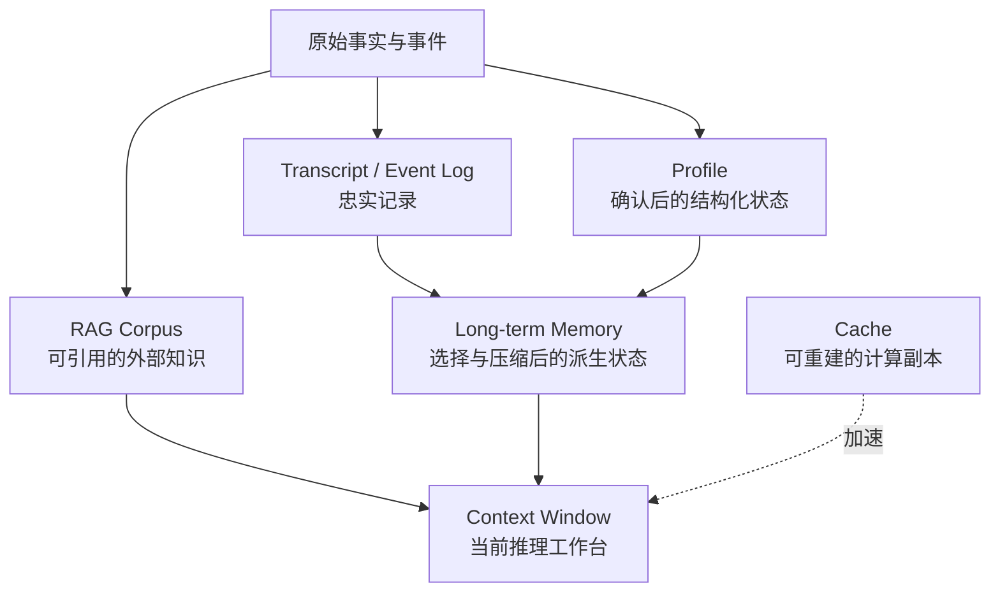
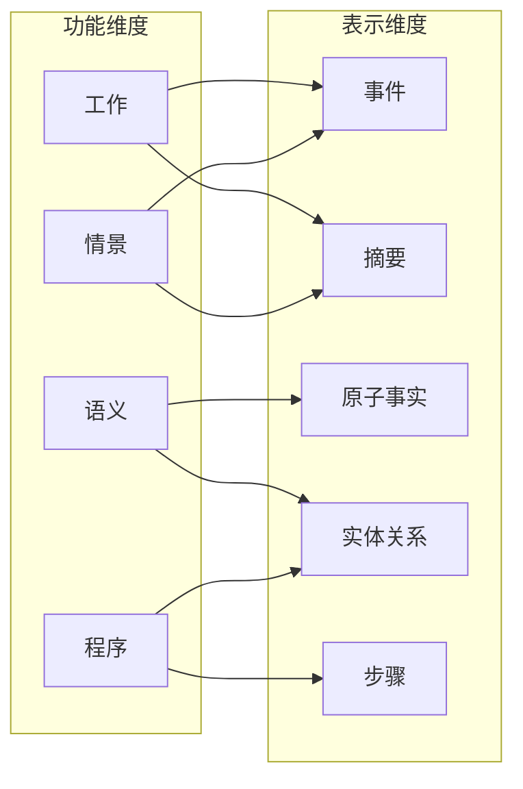
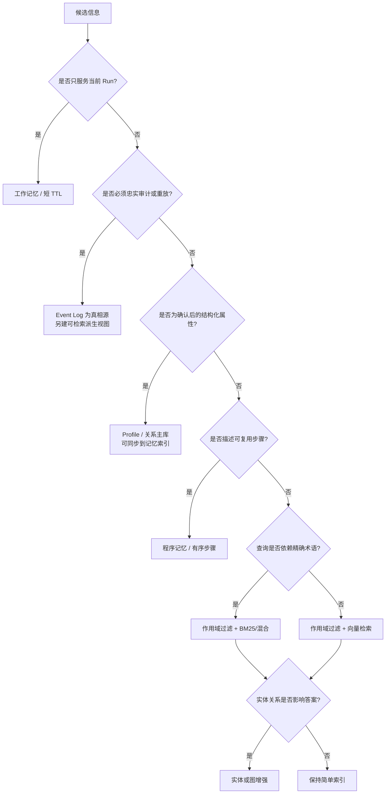
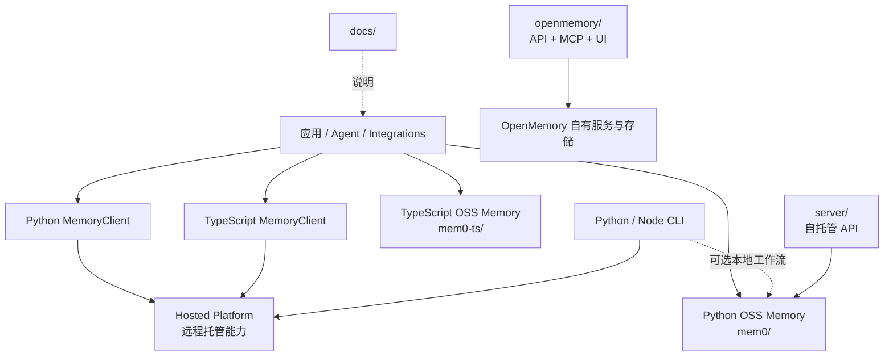
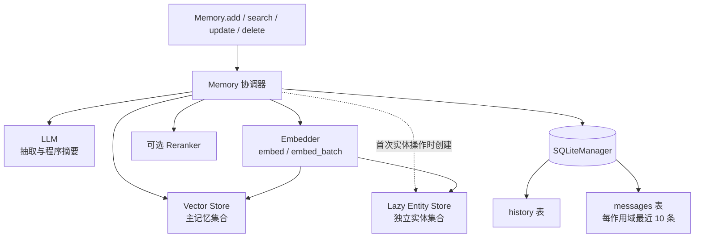
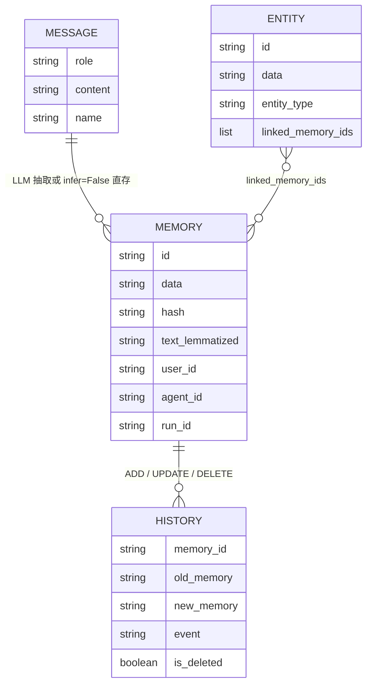
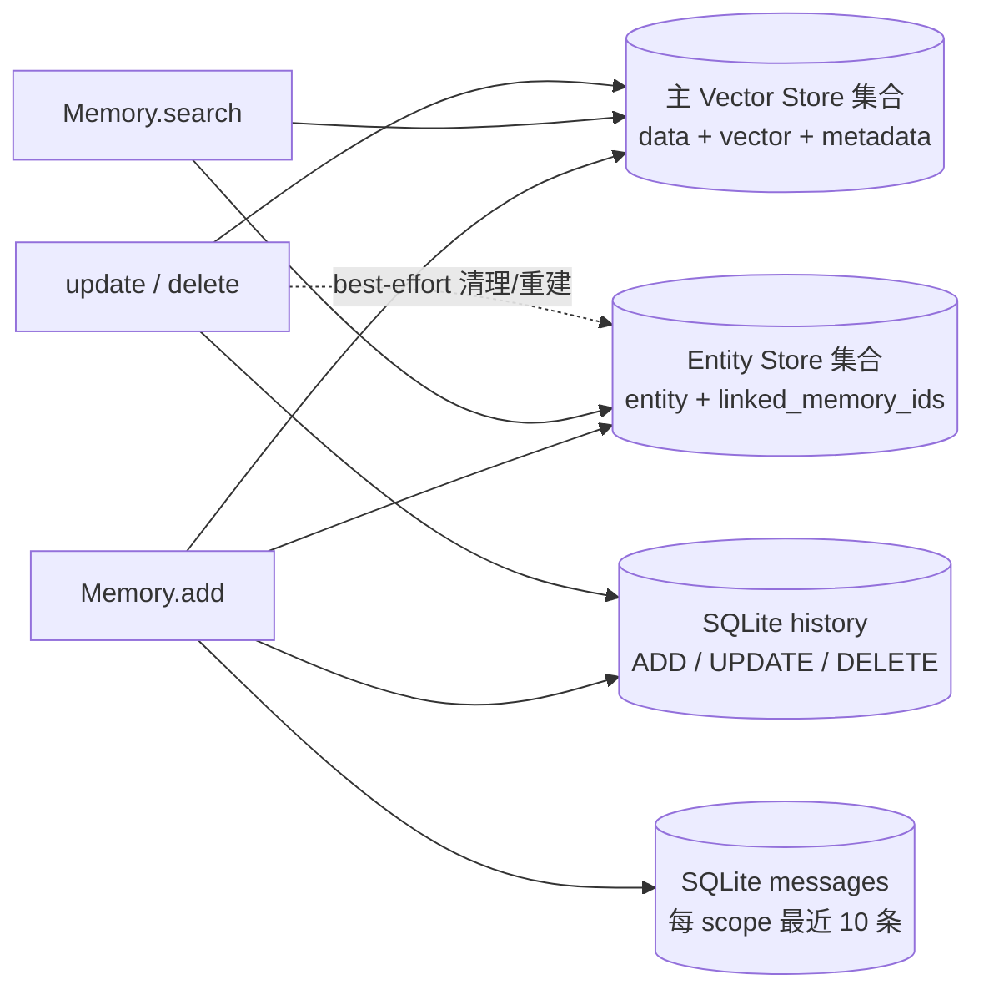

# 从第一性原理到 Mem0 源码：长期记忆系统设计教程

> 本教程面向具备后端、RAG 与 Agent harness 基础的读者。运行项目不是学习终点；目标是掌握可迁移的记忆系统设计方法。

## 1. 导读：如何学习一个记忆系统 {#chapter-1}

### 1.1 学习目标与贯穿案例

**直觉。** 假设你正在构建一个 AI 编程助手。今天用户说“示例默认用 Python，回答先给结论”，明天又让它继续排查一次 Qdrant 向量维度不一致的问题。模型即使拥有很长的上下文窗口，也不会天然知道哪些信息值得跨会话保留、这些信息属于谁、旧偏好何时失效。真正困难的不是“找个数据库把消息存进去”，而是持续做出五个设计判断：

1. **什么值得记（what is memorable）**：保留稳定偏好、项目事实和可复用经验，还是原样保存每句话？
2. **如何表示（how represented）**：保存事件、摘要、原子事实、实体关系，还是操作步骤？
3. **归谁所有（who owns it）**：属于用户、Agent、一次 Run，还是组织？
4. **如何召回（how retrieved）**：精确过滤、向量、关键词、实体、图或混合检索？
5. **何时遗忘（when forgotten）**：永久保留、设置 TTL、按价值衰减，还是仅保留审计记录？

这五问构成本文的**问题模型**。输入是消息与业务上下文，输出不是一堆无差别文本，而是带作用域、表示、检索字段和生命周期的记忆记录；硬约束则包括隔离、可追溯、延迟、成本、隐私与故障恢复。

贯穿全文的案例包含五类信息：用户长期偏好“默认 Python、先结论后原理”；项目事实“默认 Vector Store 配置是 Qdrant，本案例选用 DeepSeek 做抽取”；一次向量维度不一致的故障经历；“修改 TypeScript 后依次运行 typecheck、test、build”的操作步骤；当前正在分析混合检索评分的临时状态。随后又出现“新项目从 Redis 改用 pgvector”的变化。它们看似都是文本，所需的归属、寿命和召回方式却不同。

**候选学习方案。** 可以从 API 示例向下读，也可以从数据库表向上猜，或先建立设计模型再逐段对照源码。本文选择第三种：前两种容易把某个版本的实现偶然性当成记忆系统的本质；设计模型能让读者判断“为什么这样做”和“何时应换方案”。数据流如下。


本章之后，读者应能解释记忆与上下文、聊天记录、缓存和 RAG 的边界；能从五个维度给记忆分类；能画出 Mem0 Python OSS SDK 的主要组件与数据边界；并能区分通用设计思想、当前 OSS 行为和 Hosted Platform 能力。本文不会反推或承诺 Platform 的闭源实现。

### 1.2 三类代码标记

教程中的代码有三种证据强度，必须先分清：

| 标记 | 含义 | 能否直接当作 Mem0 行为依据 |
|---|---|---|
| `概念伪代码` | 压缩表达算法、状态或接口想法，可能省略异常与依赖 | 不能，只用于推理 |
| `教学实现` | 可独立理解或运行的简化 Python，强调机制而非生产完备性 | 不能，它是模型的一个实现 |
| `Mem0 源码` | 与当前仓库文件和符号核对过的真实片段或等价摘录 | 可以，但仍要注意版本与上下文 |

例如，“一次写入应该同时落主记录和历史”是期望模型；当前 OSS 中主向量库与 SQLite 不是共享事务，因此不能从期望推导出原子提交。阅读时要沿着“契约—调用点—故障边界”核对，而不是只看类名。

> **代码标记：`Mem0 源码`** — `mem0/__init__.py`

```python
from mem0.client.main import AsyncMemoryClient, MemoryClient
from mem0.memory.main import AsyncMemory, Memory
```

这四个入口已经揭示第一条重要边界：`Memory` / `AsyncMemory` 是 OSS 本地组合对象；`MemoryClient` / `AsyncMemoryClient` 是访问 Hosted Platform 的客户端。名称相近不代表执行位置、存储或能力相同。

### 1.3 推荐阅读路线

**路线 A：系统设计。** 依次阅读第 2、3、5 章，先写出不变量与选型，再进入生命周期和工程化章节。适合要设计自己的记忆层或准备系统设计面试的读者。

**路线 B：源码阅读。** 先读第 4 章定位仓库边界，再从 `mem0/memory/main.py` 的 `Memory.__init__()`、`add()`、`search()` 展开到 Factory、Base contract 和具体 Provider。遇到字段时回到第 5 章，不要按目录机械遍历所有 Provider。

**路线 C：动手实验。** 先理解第 2、3 章，运行后文 V0—V4 的本地教学实现，再把每个机制映射回 Mem0。真实 DeepSeek、Qdrant 或 API Key 只是可选实验，不能代替确定性的单元验证。

**源码对照方法。** 每遇到一个结论，做三步检查：定义在哪里；谁调用它；失败后哪个存储已改变。例如 `VectorStoreBase.keyword_search()` 默认返回 `None`，说明“支持混合检索”不能只从统一方法名判断，还要看具体 Provider 是否覆盖方法。每遇到 Platform 宣传能力，也应回到 `MemoryClient` 的远程调用边界，而不能把它归因于本地 `Memory`。

**取舍。** 设计先行会比复制 quickstart 慢，但能降低三类长期成本：把 transcript 当 memory 导致噪声增长；把 metadata 当隔离机制却漏加过滤条件；把多个 best-effort 写入误认为事务导致难以修复的不一致。代价是读者必须同时维护“理论模型”和“当前实现”两张图，本文会用显式标签控制这种认知负担。

**本章练习与面试思考：**

1. **代码阅读题：** 打开 `mem0/__init__.py`，沿四个导出分别找到定义。哪些类在本进程组装存储，哪些类通过 HTTP 访问远端？记录证据，不凭类名作答。
2. **设计决策题：** 对“当前正在分析混合检索评分”选择 Run 级临时记忆或 User 级长期记忆。先说明寿命、错误召回影响与删除条件，再做选择。
3. **面试题：** “为什么长上下文不能替代长期记忆？”答题路径应包含需求时间跨度、选择与压缩、作用域隔离、检索成本、冲突和遗忘，而不是只说 token 有上限。

## 2. 从第一性原理理解记忆 {#chapter-2}

### 2.1 为什么上下文窗口不是长期记忆

**直觉。** 上下文窗口像工作台：当前需要的代码、问题和少量背景被摊在桌面上；长期记忆像经过整理的档案系统。扩大桌面并不会自动决定哪些纸应归档、同一事实的新旧版本如何处理，也不会让不同用户的纸天然隔离。

**模型。** 上下文是一次推理请求的输入序列，优化目标是让当前生成正确；长期记忆是跨请求维护的有状态系统，优化目标是未来在正确作用域、正确时间召回有用信息。前者通常随请求结束而消失，后者需要写策略、索引、历史与删除语义。把全部历史塞回窗口，只是重放，不是记忆：成本随历史增长，噪声挤占注意力，敏感信息被过度传播，过时事实还会与新事实竞争。

候选方案包括全量重放、滚动摘要、纯 RAG 和显式记忆层。全量重放最忠实但昂贵；滚动摘要便宜但会累积压缩误差；纯 RAG 擅长从相对稳定的语料找证据，却不天然解决“从对话中抽取什么、归谁、何时更新”；显式记忆层增加写路径复杂度，但把这些决策变成可测试的策略。实际系统常组合它们：窗口承载工作记忆，RAG 提供外部知识，长期记忆维护个体化和跨会话状态。

### 2.2 聊天记录、缓存、RAG、画像、事件日志与记忆

边界不应按“存在哪里”划分，而应按用途、真相源与失败语义划分。下面的表覆盖同一份信息可能出现的七种载体。

| 载体 | 主要目的 | Source of truth | 写入策略 | 典型检索 | 生命周期 | 失败影响 |
|---|---|---|---|---|---|---|
| Context window | 完成当前一次推理 | 当前请求编排器 | 每次请求组装，可截断 | 由模型注意力直接使用 | 一次请求或短会话 | 当前回答降质，通常不损坏持久状态 |
| Transcript | 忠实记录对话 | 原始消息日志 | 追加为主，尽量少改 | 按会话、时间、分页 | 依合规策略保留 | 丢失审计与重放能力 |
| Cache | 避免重复计算、降延迟 | 上游系统，不是缓存本身 | 可重建、按 key 覆盖 | 精确 key | TTL / LRU | 命中率下降或短暂陈旧；不应成为事实永久丢失 |
| RAG corpus | 为问题提供文档证据 | 文档、数据库或知识库 | 采集、切块、版本化索引 | 向量、关键词、过滤、混合 | 跟随语料版本 | 引用遗漏、召回错误或答案无依据 |
| Profile | 提供稳定、结构化属性 | 业务主库或经确认的画像字段 | 校验后 upsert | 主键与字段读取 | 属性有效期内 | 个性化错误，严重时影响权限或合规 |
| Event log | 记录发生过什么并支持重放/审计 | 不可变事件序列 | append-only | 实体、时间、事件类型 | 长期或法规期限 | 无法重建状态、审计链断裂 |
| Long-term memory | 为未来任务选择并组织有用经验 | 取决于设计；通常是派生状态并保留出处 | 抽取、去重、显式更新/删除、过期 | 作用域过滤 + 语义/关键词/实体等 | TTL、长期、衰减或审计策略 | 错记、串租户、过时召回会直接污染决策 |



图中箭头表达信息供给，不表示所有系统都必须这样部署。关键选择是：若“用户默认 Python”已由设置页确认，Profile 可以是权威源，记忆只是便于语义召回的副本；若它只在对话里出现，Transcript 是证据，抽取出的长期记忆是可能出错的派生判断。若“Redis 改用 pgvector”是配置库中的正式变更，应以配置库为真相源，而不是让记忆承担配置管理。

### 2.3 记忆系统的五个动作：选择、压缩、组织、召回、遗忘

长期记忆可以抽象为持续运行的五动作管道：

- **选择**过滤寒暄、重复和无未来价值的信息，回答“什么值得记”；
- **压缩**把多轮话语转换成摘要、原子事实或步骤，同时保留足够出处；
- **组织**附加所有权、时间、实体、hash、Embedding 和业务元数据；
- **召回**先限定作用域，再生成候选、融合信号、排序并注入当前上下文；
- **遗忘**处理 TTL、显式删除、价值衰减、冲突替代和隐私请求。

> **代码标记：`概念伪代码`** — 五动作的最小接口，不代表 Mem0 的函数签名

```python
def remember(messages, scope, policy):
    selected = policy.select(messages)
    records = policy.compress(selected)
    indexed = policy.organize(records, scope)
    policy.persist(indexed)


def recall(query, scope, now):
    candidates = retrieve_within(scope, query)
    return [item for item in rank(candidates) if not should_forget(item, now)]
```

**候选方案与选择。** 选择和压缩可用规则、LLM 或两者组合。规则确定、便宜但覆盖有限；LLM 能理解隐含偏好与事件，却会误抽取、漏抽取或返回非法结构。组织可以只放向量，也可以同时保留关键词、实体和结构化字段；信号越多，召回越稳健，写放大与一致性问题也越大。Mem0 当前 Python OSS 的自动推断路径使用 LLM 抽取原子记忆、Embedding 与主向量集合，并维护关键词字段、实体集合及 SQLite 辅助状态；这是一项工程选择，不是所有记忆系统的唯一答案。

### 2.4 从业务约束推导系统不变量

不变量是“任何成功路径都不得破坏”的约束，比组件名称更稳定。以编程助手为例可推导：

1. **作用域先于相似度。** 即使两条向量非常相似，Alice 的偏好也不能被 Bob 召回。查询必须至少由 `user_id`、`agent_id` 或 `run_id` 之一限定，并对提供的多个 ID 同时过滤。
2. **原始证据与派生记忆可区分。** “用户说了什么”和“系统推断用户偏好什么”不是同一事实；否则无法解释和纠错。
3. **时间有语义。** 创建时间、更新时间、事件发生时间和过期日期不可混用；“Redis 改用 pgvector”需要能表达先后或至少保留冲突。
4. **失败可观察、可修复。** 主记录写入成功而历史或实体失败时，系统必须能检测并补偿，不能假装一次调用天然原子。
5. **删除覆盖所有派生副本。** 隐私删除不能只删向量而留下实体引用、缓存或消息副本。
6. **记忆是非可信输入。** 召回文本可能过时、抽取错误或含 prompt injection；使用方仍需校验权限与关键业务事实。

**数据流与源码对照。** 当前 `mem0/memory/main.py::_build_filters_and_metadata()` 对 `user_id`、`agent_id`、`run_id` 做校验，将它们加入存储 metadata 和查询 filters；若三者都没有则抛出 `Mem0ValidationError`。这落实了“操作必须有作用域”，但不能单独保证所有 Provider 的底层隔离、调用方授权或跨存储删除完整性。`Memory.add()` 继续把数据交给 LLM、Embedder、Vector Store 与 SQLiteManager，多边写入没有共享事务，因此原子性仍是上层工程问题。

**取舍。** 强不变量通常需要更高成本：以关系数据库做事务主表再异步建向量索引，写入延迟和运维复杂度上升，却比直接 best-effort 写多个存储更容易恢复；只存原子记忆检索干净，却损失原话细节；保留全量 transcript 可审计，却扩大隐私面。设计者应先根据失败影响确定不变量，再选组件，而不是由现成 Vector Store 反推需求。

### 2.5 本章练习与面试思考

1. **代码阅读题：** 阅读 `mem0/memory/main.py::_build_filters_and_metadata()`。同时传入 `user_id` 与 `run_id` 时，返回的 metadata 和 filters 各有哪些字段？再找出没有任何作用域 ID 时的错误路径。
2. **设计决策题：** “向量维度不一致导致某次写入失败”应只存为情景记忆，还是同时保留 event log？用真相源、检索方式、保留期限和失败影响表述选择。
3. **面试题：** 设计一个长期记忆层时，先问哪五个问题？答题时将“什么值得记、如何表示、归谁所有、如何召回、何时遗忘”分别映射到写策略、数据模型、隔离、索引和生命周期。
4. **推演题：** 缓存清空后系统仍应正确，但记忆库清空后个性化会退化。为二者分别定义 SLO、备份和重建来源。

## 3. 记忆分类与设计选型 {#chapter-3}

### 3.1 按功能：工作、语义、情景与程序记忆

**直觉。** “正在分析混合评分”服务当前任务；“示例默认 Python”是可跨事件复用的事实；“上次因 Embedding 维度不一致写入失败”是带时间与情境的经历；“改完 TypeScript 后运行 typecheck、test、build”是操作方法。把四者都压成同一种文本，会丢失使用方式。

| 功能类型 | 回答的问题 | 案例 | 典型寿命与召回 |
|---|---|---|---|
| 工作记忆（working） | 我现在在做什么？ | 当前分析混合检索评分 | Run 内短期；按任务直接读取 |
| 语义记忆（semantic） | 稳定事实或偏好是什么？ | 默认使用 Python | 长期；作用域过滤 + 语义/精确检索 |
| 情景记忆（episodic） | 何时发生过什么，结果如何？ | 向量维度故障及解决过程 | 中长期；时间、实体、语义联合检索 |
| 程序记忆（procedural） | 应按什么步骤做？ | typecheck → test → build | 流程有效期内；按任务与 Agent 召回 |

候选方案是单一通用集合、按类型分集合，或统一物理集合加类型字段。单集合最简单；分集合可为不同类型定制索引和 TTL，但跨类型召回更复杂；统一集合加字段便于运营，却要求每次过滤与排序正确。Mem0 的理论枚举提供语义、情景和程序三个标签，不包含 working；工作记忆通常仍由 Agent harness 的当前上下文或 Run 级状态承担。

### 3.2 按归属：User、Agent、Run 与 Organization

归属回答的不是“谁说了这句话”，而是“谁的未来行为可以使用这条记忆”。User 级适合个人偏好；Agent 级适合某个助手角色学到的工具习惯；Run 级适合当前任务中间状态；Organization 级适合团队规范，但必须经过更严格的写授权和审核。

候选层级可以继承（Organization → User → Run）、完全隔离，或查询时显式并集多个作用域。继承方便，但同名规则冲突时必须定义优先级；完全隔离安全却重复存储；显式并集可控但每次查询更复杂。当前 Python OSS `Memory` 的公开作用域 ID 是 `user_id`、`agent_id`、`run_id`，可同时提供；没有等价的 `organization_id` 参数。组织级是通用设计维度，若自行放进 metadata，仍需应用层授权和过滤，不能把它描述成当前 OSS 的一等隔离能力。

### 3.3 按表示：事件、摘要、原子事实、实体关系与步骤

表示决定可更新性和检索粒度：

- **事件**保真度高，适合审计与重放；噪声和规模最大。
- **摘要**压缩率高，适合快速恢复会话；局部更新困难，摘要错误会累积。
- **原子事实**一条只表达一个判断，如“用户偏好 Python”；易去重、召回和显式更新，但抽取会损失语气与证据。
- **实体关系**表达 Python、Mem0、Qdrant、pgvector 等实体之间的连接；利于关联扩展，但实体消歧和关系时态昂贵。
- **步骤**保留顺序、前置条件与失败分支；适合程序记忆，不能随意拆成无序事实。

Mem0 当前自动推断主路径让 LLM 返回新的原子记忆，再为文本建立向量与关键词字段；实体抽取随后写入独立实体集合，以 `linked_memory_ids` 指回主记忆。提示词中的“关联已有记忆 ID”与实体集合中的实体链接不是同一层：前者是抽取结果的语义关联字段，是否持久化必须看后续 payload 构造；后者有明确的实体 upsert 数据流。不能仅凭 prompt 出现字段就宣称系统已持久化记忆图。

### 3.4 按生命周期：瞬时、TTL、长期、衰减与审计

生命周期应由“未来价值 × 风险 × 法规”决定，而不是由存储默认值决定。工作记忆可随 Run 结束删除；构建产物地址可设 TTL；稳定偏好长期保留但允许用户修正；召回价值随时间下降的建议可衰减；关键变更的原始事件则可能进入独立审计留存。

TTL 是硬截止，衰减是排序权重随时间降低，显式删除是业务或隐私动作，审计保留则可能要求主视图不可见但变更历史仍在。它们不能互换。当前 OSS `Memory.add()` 接受 `expiration_date`（日期），搜索和列表默认隐藏已过期记录；`timestamp` 被明确作为 Platform-only temporal parameter 拒绝。OSS 的 `_OSSProject.update(decay=True)` 也会给出能力边界错误。因此本文可以讲衰减的通用设计，却不会声称本地 `Memory` 已实现完整时间推理或衰减。

### 3.5 按检索：精确、向量、关键词、实体、图与混合检索

**候选方案。** 精确检索适合 ID、枚举和强过滤；向量检索处理改写与语义近似；关键词/BM25 保留标识符、错误码和专有名词；实体检索把“Qdrant”这样的提及扩展到关联记忆；图检索适合多跳关系；混合检索融合多个信号。

例如用户问“之前 index size 报错怎么解决”，纯向量可能找到维度故障，BM25 对具体错误词更敏感，实体信号可提升与 Qdrant、Embedding 相关的主记忆。选择不是“哪种最先进”，而是看查询长度、术语密度、可解释性、延迟和 Provider 支持。当前 `VectorStoreBase.keyword_search()` 默认返回 `None`；只有覆盖该方法的 Provider 才提供关键词候选分数。统一基类提供能力探测点，不保证每个实现都有相同检索能力。

### 3.6 选型矩阵与决策树

下面先用“功能 × 表示”形成二维分类矩阵。单条记忆可以落在多个格子，但主表示应由主要使用方式决定。

| 功能 \ 表示 | 事件 | 摘要 | 原子事实 | 实体关系 | 步骤 |
|---|---|---|---|---|---|
| 工作 | 当前工具调用日志 | 当前任务摘要 | 当前约束 | 活跃文件/服务关系 | 下一步动作 |
| 语义 | 事实来源事件 | 用户画像摘要 | “默认 Python” | 项目—Vector Store | 规范通常不以此表示 |
| 情景 | 故障时间线 | 事故复盘摘要 | “曾发生维度错误” | 故障—组件关系 | 当时的恢复步骤 |
| 程序 | 执行轨迹 | SOP 摘要 | 前置条件 | 工具依赖关系 | typecheck → test → build |



实际选型还要横向比较约束：

| 约束 | 优先方案 | 需要警惕 |
|---|---|---|
| 强一致、关键权限 | 关系主库/确认后的 Profile，记忆只作派生索引 | 不让 LLM 抽取结果成为授权真相源 |
| 高频更新 | 原子事实或版本化事件 | 摘要重写竞争、向量索引写放大 |
| 高可解释 | 原始证据 + 精确/BM25 + score 明细 | 只返回相似度无法说明来源 |
| 极低延迟 | 预计算画像、缓存、较小候选池 | 陈旧与召回率下降 |
| 低成本 | 规则选择、批量 Embedding、较少索引 | 隐含事实召回下降 |
| 高隐私 | 最小化收集、短 TTL、可追踪删除 | 多个派生存储残留 |
| 大规模 | 分区作用域、异步索引、冷热分层 | 跨分区召回与修复复杂 |

决策树把约束变成可执行问题：



### 3.7 Mem0 理论分类与当前 API 能力的差异

> **代码标记：`Mem0 源码`** — `mem0/configs/enums.py::MemoryType`

```python
class MemoryType(Enum):
    SEMANTIC = "semantic_memory"
    EPISODIC = "episodic_memory"
    PROCEDURAL = "procedural_memory"
```

`MemoryType.SEMANTIC` 表示可跨事件复用的事实/概念，`MemoryType.EPISODIC` 表示带经历与情境的事件，`MemoryType.PROCEDURAL` 表示完成任务的方法或步骤。这是有用的理论词汇和枚举定义，但当前 OSS 写入 API 并非对三者提供对称分支。

> **代码标记：`Mem0 源码`** — `mem0/memory/main.py::Memory.add()` 的显式分支

```python
if memory_type is not None and memory_type != MemoryType.PROCEDURAL.value:
    raise Mem0ValidationError(...)

if agent_id is not None and memory_type == MemoryType.PROCEDURAL.value:
    return self._create_procedural_memory(messages, metadata=processed_metadata, prompt=prompt)
```

因此，在当前同步 `Memory.add()` 中，显式传入 `semantic_memory` 或 `episodic_memory` 会被拒绝；只有同时具备 `agent_id` 且 `memory_type="procedural_memory"` 才进入 `_create_procedural_memory()`，由 LLM 生成程序摘要、写入 `memory_type` metadata、Embedding 后保存。其他普通写入走通用事实抽取/原始直存路径。异步 `AsyncMemory.add()` 也有对应分支。枚举存在不等于公开 API 已实现三套完整、对称的生命周期。

**取舍。** 显式程序分支让操作轨迹能用专门 prompt 压缩，接口却可能让读者误以为 semantic/episodic 同样可选。生产封装应校验当前版本能力，并把理论类型作为自己的领域模型时保留映射层，避免直接耦合枚举就假设行为。

### 3.8 本章练习与面试思考

1. **代码阅读题：** 在 `mem0/memory/main.py` 中比较同步和异步 `add()` 的 `memory_type` 校验与 procedural 分支，确认触发条件、调用方法和返回结构是否对齐。
2. **设计决策题：** 为“新项目从 Redis 改用 pgvector”选择事件、原子事实或二者并存。说明如何表达旧事实、当前事实、发生时间、真相源与冲突召回。
3. **面试题：** 给记忆分类有什么工程价值？回答应从功能、归属、表示、生命周期、检索五维展开，并说明分类如何改变 schema、索引、TTL、权限和评估指标。
4. **面试追问：** 为什么枚举里有 `SEMANTIC` 就不能断言 `Memory.add(memory_type="semantic_memory")` 可用？用“定义存在—入口校验—调用分支—测试行为”的源码验证路径作答。

## 4. Mem0 的宏观架构 {#chapter-4}

### 4.1 Monorepo 地图

**直觉。** 第一次进入仓库时，最危险的做法是搜索到同名 `Memory` 就开始逐行读。Mem0 是 polyglot monorepo：本地 SDK、Hosted Platform 客户端、自托管 API、完整应用、CLI 和编辑器集成都在同一仓库，调用相似但部署边界不同。先画地图，才能知道某个结论属于哪一层。

| 路径 | 主要职责 | 本教程如何使用 | 不应混淆的边界 |
|---|---|---|---|
| `mem0/` | Python SDK：本地 `Memory` / `AsyncMemory`、远程 `MemoryClient`、Provider、配置与核心算法 | 第 3—8 章的主要源码证据 | `MemoryClient` 的服务端行为不在本地 `Memory` 中执行 |
| `mem0-ts/` | TypeScript SDK：Hosted client 与 OSS memory | 用于比较语言接口和能力边界 | 不能用 Python 实现细节推断 TS 内部完全相同 |
| `server/` | 自托管 API 服务及其 Docker 组合 | 说明把 OSS 能力包装为团队可访问服务 | 它不是 Hosted Platform 的开源镜像，也不等于单进程 Library |
| `openmemory/` | 自托管记忆平台，包含 FastAPI/MCP 后端与 Next.js UI | 说明产品化 UI、MCP、数据库迁移等外围能力 | 它有自己的应用架构与存储，不应和 `server/` 或核心 SDK 混为一个进程 |
| `cli/python/`、`cli/node/` | 终端工作流与平台 API 操作；Python CLI 可选 OSS 模式 | 展示人和 Agent 如何从终端管理记忆 | CLI 是调用入口，不是新的记忆算法真相源 |
| `integrations/` | 编辑器、Agent、Vercel AI SDK、OpenClaw、Pi Agent 等集成 | 理解生命周期 hook 和框架适配 | 集成层决定何时调用记忆，不应私自绕过核心作用域和权限 |
| `docs/` | API、概念、集成与迁移文档 | 补充公开用法和能力声明 | 文档需与当前源码交叉验证，尤其是版本相关行为 |

仓库地图对应三个问题模型：**算法在哪里执行、状态在哪里持久化、调用方信任边界在哪里**。对本教程而言，默认答案是：重点研究 `mem0/memory/main.py` 中 Python OSS `Memory`；需要理解远程边界时读 `mem0/client/main.py`；Server、OpenMemory 和 Platform 只做职责比较，不反推闭源细节。



图中的虚线表示工作流或说明关系，不代表固定运行时依赖。尤其不能把 Hosted Platform 画成 `server/` 的另一个部署名称；README 将 Library、Self-Hosted Server、Cloud Platform 作为不同产品路径列出。

### 4.2 OSS Library、Server、OpenMemory 与 Platform

**候选部署。** 若目标是本地原型，Library 让应用在进程内直接创建 Provider 和存储，路径短、调试方便，但应用自己承担密钥、扩缩容和数据生命周期。团队自托管可选择 `server/` 暴露 API，换来集中鉴权与服务治理，也增加 Docker、数据库和升级成本。OpenMemory 更接近带 UI 与 MCP 的自托管产品形态，适合需要可视化和 Agent 工具接入的场景。Hosted Platform 通过 `MemoryClient` 使用远程服务，减少基础设施运维，但数据边界、成本与网络依赖不同。

| 形态 | 执行边界 | 主要状态 | 接口 | 适合场景 |
|---|---|---|---|---|
| OSS Library | 应用进程内 | 配置的 Vector Store + 本地 SQLite 辅助状态 | `Memory` / `AsyncMemory` | 原型、嵌入式服务、完全掌控组件 |
| Self-Hosted Server | 自建服务进程/容器 | 自托管服务配置的数据库和图/向量组件 | HTTP API | 团队共享、集中鉴权、自有基础设施 |
| OpenMemory | 自建完整应用 | OpenMemory API 所管理的关系/向量状态 | UI、API、MCP | 人机协作、可视化与 MCP 工作流 |
| Hosted Platform | Mem0 托管边界 | 远端平台管理 | `MemoryClient` / `AsyncMemoryClient`、API | 零运维或需要平台能力 |

**选择。** 本文用 OSS Library 解剖机制，因为源码可证、调用链短。这里的结论不自动覆盖 Server 的鉴权、不覆盖 OpenMemory 的 Alembic 数据模型，也不承诺 Platform 的时间推理、衰减、规模或内部一致性与 OSS 相同。反过来，Platform 文档中的能力也不能直接写成 `Memory` 的本地行为。

**取舍。** 进程内组合最透明，却把可靠性责任推给应用；服务化便于多语言和集中治理，却引入网络失败与版本兼容；托管降低运维，却需要清晰的数据驻留、成本和退出方案。架构评审应先问组织能承担什么，而不是只比 API 是否同名。

### 4.3 Memory 的组件组合

`Memory` 不是一个数据库别名，而是协调多个可替换组件的门面：LLM 负责抽取/摘要，Embedder 把文本映射为向量，Vector Store 保存主记忆并检索，可选 Reranker 二次排序；`SQLiteManager` 维护 history 与最近消息；Entity Store 复用 Vector Store Provider、使用独立集合，并在首次访问时惰性创建。



**数据流。** 初始化只创建主 LLM、Embedder、Vector Store、SQLiteManager 和可选 Reranker，`_entity_store` 初始为 `None`。写入时主路径先取 SQLite 最近消息与主向量候选，LLM 抽取后生成 Embedding，写主集合与 history，再 best-effort 建实体索引，最后保存最近消息。后续章节会展开全链路；本章先记住：这些箭头跨越多个组件和存储边界。

### 4.4 Provider Factory 与依赖倒置

**模型。** 高层 `Memory` 应依赖“生成文本”“生成向量”“搜索/写入记录”这些契约，而不是依赖 OpenAI 或 Qdrant 的具体 SDK。Provider Factory 把配置中的字符串映射为具体类，完成延迟导入与构造。这是依赖倒置：业务编排面向稳定能力，部署通过配置选择实现。

> **代码标记：`Mem0 源码`** — `mem0/memory/main.py::Memory.__init__()` 的核心创建顺序

```python
self.embedding_model = EmbedderFactory.create(
    self.config.embedder.provider,
    self.config.embedder.config,
    self.config.vector_store.config,
)
self.vector_store = VectorStoreFactory.create(
    self.config.vector_store.provider, self.config.vector_store.config
)
self.llm = LlmFactory.create(self.config.llm.provider, self.config.llm.config)
self.db = SQLiteManager(self.config.history_db_path)
```

若配置了 reranker，构造函数再调用 `RerankerFactory.create()`。`MemoryConfig` 以 Pydantic model 聚合 `VectorStoreConfig`、`LlmConfig`、`EmbedderConfig`、可选 `RerankerConfig`、`history_db_path`、版本和自定义抽取指令。当前 `VectorStoreConfig` 的默认 Provider 是 `qdrant`；LLM 与 Embedder 的默认 Provider 是 `openai`。这只是当前默认配置，不代表案例必须使用它们，也不代表 Qdrant 是独立的系统真相源。

三个 Base contract 定义了 Provider 的最小能力：

| 契约 | 必须/默认方法 | 高层依赖的语义 |
|---|---|---|
| `LLMBase` | 抽象 `generate_response(messages, tools=None, tool_choice="auto", **kwargs)` | 给定消息生成文本或结构化响应；具体模型参数由 Provider 处理 |
| `EmbeddingBase` | 抽象 `embed(text, memory_action)`；默认 `embed_batch()` 逐条调用 | `memory_action` 区分 add/search/update；批量能力可由 Provider 优化 |
| `VectorStoreBase` | 抽象 create/insert/search/delete/update/get/list/reset 等；`keyword_search()` 默认 `None`；`search_batch()` 默认逐条 | 搜索分数应越高越相似；关键词和原生批量是可选增强 |

`LlmFactory` 保存 Provider 到“实现类路径 + 配置类”的映射；`EmbedderFactory` 先构造 `BaseEmbedderConfig`；`VectorStoreFactory` 必要时把 Pydantic config 转成 dict 后以关键字参数构造；`RerankerFactory` 则校验各自配置。工厂统一了创建，不等于抹平所有能力差异：例如 Vector Store 是否覆盖 `keyword_search()` 仍需运行时判断。

**候选方案与取舍。** 可以直接在 `Memory` 中写 `if provider == ...`，实现简单但高层随 Provider 数量膨胀；可以用 Python entry point 做插件发现，扩展更开放但调试和安全复杂；当前显式映射工厂可读、可控，却要求新增 Provider 时更新注册映射和可选依赖。依赖倒置减少的是编排层耦合，不会消除不同服务的分数尺度、批量限制、事务和错误类型差异。

### 4.5 同步与异步接口

Python OSS 同时导出 `Memory` 与 `AsyncMemory`。同步接口适合脚本、传统 WSGI 或简单后台任务；异步接口适合已有 event loop、需要并发等待网络 Provider 的服务。Hosted 端也分别有 `MemoryClient` 和 `AsyncMemoryClient`。选择时应保持调用栈一致，不要在 event loop 中直接执行长时间同步网络调用。

当前 `AsyncMemory` 与同步类拥有对应的初始化、惰性 `entity_store`、`add/search/update/delete/history` 等路径；部分同步工作通过 `asyncio.to_thread` 包装，LLM 若提供异步生成能力则可走异步分支。这意味着“有 async 方法”不必然等于每个底层 Provider 都原生非阻塞，也不保证多存储操作成为一个并发事务。

> **代码标记：`教学实现`** — 用统一领域接口隔离同步/异步调用方

```python
from typing import Protocol


class AsyncMemoryPort(Protocol):
    async def search(self, query: str, *, user_id: str) -> dict: ...


async def load_user_preferences(store: AsyncMemoryPort, user_id: str) -> dict:
    return await store.search("编程与回答偏好", user_id=user_id)
```

教学接口刻意只暴露用例需要的能力。它不复制 Mem0 的完整签名，价值在于让应用层不必到处判断本地还是 Hosted、同步还是异步。

### 4.6 本章练习与面试思考

1. **代码阅读题：** 从 `Memory.__init__()` 画出四个 Factory 的输入配置和返回对象，再阅读 `entity_store` property，说明它为何是 lazy、实体集合名如何从主集合名派生。
2. **设计决策题：** 一个 20 人团队要让 Python、TypeScript 和编辑器插件共享记忆，应使用进程内 Library 还是自托管服务？比较鉴权、隔离、网络故障、运维和版本升级后再选择。
3. **面试题：** Provider Factory 解决了什么、没解决什么？答题应区分对象创建解耦与能力语义差异，并引用 `VectorStoreBase.keyword_search()` 默认返回 `None` 作为例子。
4. **故障推演：** 若 LLM 可用但 Vector Store 初始化失败，`Memory` 能否部分可用？结合构造顺序说明启动失败策略为何通常优于带缺失依赖继续服务。

## 5. 核心数据模型与系统不变量 {#chapter-5}

### 5.1 Message、Memory、Entity 与 History

**直觉。** 用户说“新项目改用 pgvector”是一条 Message；系统抽取“项目 X 当前使用 pgvector”是一条 Memory；其中 pgvector 与项目 X 是 Entity；把旧的 Redis 事实更新或删除则产生 History。四者分别承担证据、可用状态、关联入口和变更解释，不能合并成一个含糊的 `text` 表。

**当前模型。** Python OSS 的 `Memory.add()` 接受字符串、单个 dict 或 `list[dict]`；普通文本会标准化为 `{"role": "user", "content": ...}`。这里的 Message 是 API 输入结构，不是 `mem0/configs/base.py` 中的持久化 Pydantic `Message` 类——当前该文件并没有这样的类。`MemoryItem` 才是查询结果的 Pydantic 投影，字段包括 `id`、`memory`、可选 `hash`、`metadata`、`score`、`created_at`、`updated_at`。

主 Memory 的 Vector Store payload 以 `data` 保存文本，并附带 hash、检索字段、作用域、时间和 metadata。Entity 也不是关系图节点类，而是独立向量集合中的记录：payload 主要包含 `data`、`entity_type`、`linked_memory_ids` 以及作用域 ID。History 是 SQLite `history` 表的追加记录，保存 `memory_id`、old/new memory、event、created/updated time、删除标志以及可选 actor/role。



图是逻辑关系，不是外键图：实体集合的 `linked_memory_ids` 是 payload 中的 ID 列表，SQLite history 也没有对 Vector Store 建数据库外键。因此悬挂引用和不一致必须由代码清理、对账或补偿。

### 5.2 user_id、agent_id、run_id 与 actor_id

**问题模型。** 所有权至少有三层：哪一片记忆空间可被查询（scope）、哪条输入由谁产生（actor/role）、抽取事实描述谁（attribution）。这三层经常同名，却不能互相替代。

| 字段/概念 | 回答的问题 | 当前 OSS 来源与行为 | 能否替代作用域 |
|---|---|---|---|
| `user_id` | 这是否属于某个用户的记忆空间？ | `add/search/get_all/delete_all` 等操作的作用域 ID，可进入 metadata 和 filters | 是一类作用域，但不能替代 agent/run 的语义 |
| `agent_id` | 这是否属于某个 Agent 的记忆空间？ | 作用域 ID；也是显式 procedural 分支的必要条件之一 | 是一类作用域 |
| `run_id` | 这是否只属于某次运行/任务？ | 作用域 ID，适合临时任务隔离 | 是一类作用域 |
| `actor_id` | 具体是哪位参与者产生/拥有这条原始消息记录？ | 查询可作额外过滤；`infer=False` 时来自 message `name`；更新保留原 actor | 否，它只缩小已有 session scope |
| `role` | 消息在对话协议中的角色是什么？ | 如 user/assistant/system；`infer=False` 保存到 payload，system 被跳过 | 否，同为 user role 的消息可来自不同用户 |
| `attributed_to` | LLM 抽取的记忆是在讲 user 还是 assistant？ | 自动抽取结果若提供该字段，会写入主记忆 payload | 否，它是语义归因，不是租户授权 |

`_build_filters_and_metadata()` 要求 `user_id`、`agent_id`、`run_id` 至少一个，并把所有已提供 ID 同时加入 metadata 与 filters。`actor_id` 的查询优先级是显式参数，其次是 filters 中已有值；它不会被放进基础写入 metadata，因为自动写入时来源可能稍后由消息或抽取决定。把 `role="user"` 当作 `user_id` 会让所有用户共享一个空间；把 `attributed_to="assistant"` 当作 `agent_id` 则会把“事实讲的是谁”误当成“哪个 Agent 有权读取”。

**候选作用域模型。** 可以只允许单一 scope key，简单但无法表达“某用户在某 Agent 的某 Run”；也可以允许多个 ID 做 AND 过滤，表达力强但调用方必须稳定传齐；还可以将它们编码为不可分割的 tenant key，底层简单却降低跨 Run 聚合能力。当前 OSS 选择“至少一个、多个可并存”，并通过确定性 `_build_session_scope()` 把已提供的 ID 排序拼接，供 SQLite 最近消息分区。

### 5.3 内容、hash、关键词、向量、时间与元数据

同一条 Memory 有多种表示，各自服务不同不变量：

| 字段/表示 | 作用 | 不能承担的职责 |
|---|---|---|
| `data` / API `memory` | 人可读的记忆正文 | 不能高效做语义近邻，也不是原始 transcript |
| MD5 `hash` | 对完全相同文本做快速去重与变更标识 | 不等价于语义去重，也不是安全签名 |
| `text_lemmatized` | 为 BM25/关键词检索准备规范化文本 | 不替代原文或 Embedding |
| vector | 语义检索 | 不适合精确权限过滤；维度/模型迁移需治理 |
| `created_at` / `updated_at` | 记录创建和显式更新时刻 | 不必然等于事件发生时间或用户参考时间 |
| `expiration_date` | 到期后从默认结果隐藏 | 不自动表达价值衰减或完整隐私擦除 |
| metadata | 作用域和业务过滤、来源等附加信息 | 未经约束的 metadata 不能天然保证 schema 与授权 |

当前自动抽取路径对新文本计算 `hashlib.md5(text.encode()).hexdigest()`，与检索到的已有记录 hash 及当前批次 `seen_hashes` 比较。这能消除字节相同的重复，不能识别“默认用 Python”和“代码示例首选 Python”的语义等价。`text_lemmatized` 用于关键词信号，Embedding 用于语义信号；显式 update 会重新计算三者中的 hash、lemmatized text 和向量。

时间也要分层。当前 OSS 主记录会保存 `created_at`、`updated_at`，`expiration_date` 接受 `YYYY-MM-DD` 日期；`timestamp` 参数在本地 `Memory.add()` 被拒绝并提示是 Platform-only temporal parameter。因此不要把“项目上周切换到 pgvector”的自然语言时间自动等同于 `created_at`，更不能宣称 OSS 已用 `reference_date` 完成完整时间推理。

> **代码标记：`教学实现`** — 先分开正文、检索派生字段与业务 metadata

```python
from dataclasses import dataclass, field
from typing import Any


@dataclass
class TeachingMemory:
    memory_id: str
    data: str
    scope: dict[str, str]
    content_hash: str
    keyword_text: str
    embedding: list[float]
    created_at: str
    updated_at: str
    metadata: dict[str, Any] = field(default_factory=dict)
```

这个教学模型强调字段职责，不是 Mem0 内部类的复制品。实际 Vector Store 将正文与多数字段放在 payload 中，向量由 Provider 的记录结构管理。

### 5.4 主集合、实体集合和 SQLite 辅助状态

**数据流。** 当前 `Memory` 至少涉及四块逻辑状态：主向量集合、惰性实体集合、SQLite history 表、SQLite messages 表。实体集合名通常由主 `collection_name` 加 `_entities` 派生（S3 Vectors 使用连字符）；Qdrant embedded 模式下可共享 client 以避免锁竞争，但仍是独立集合。



关键事实是：**vector memory、entity records、history 和 recent messages 是分离存储，没有共享事务。** 主向量批量 insert 完成后，SQLite history 才在自己的事务中批量写；实体链接有独立的 best-effort try/except；最近消息又由 `SQLiteManager.save_messages()` 单独开启 SQLite 事务。即使主集合与实体集合由同一个 Qdrant client 管理，也没有覆盖 SQLite 的两阶段提交。

因此可能出现主记录成功、history 失败；主记录和 history 成功、实体失败；主记录逐条降级后部分成功，但 history 按原计划记录全部 records；最后 recent messages 保存失败使调用报错，而先前状态已经存在。后续工程章节会讨论 outbox、幂等 key、对账和补偿。本章先建立一个不变量：对外宣称“写入成功”之前，必须定义成功包含哪些存储；失败返回后也必须允许检查是否部分成功。

**候选方案与取舍。** 单一支持事务的数据库可把正文、历史和关系原子提交，再异步构建向量索引，恢复简单但搜索新鲜度是最终一致；当前多 Provider + SQLite 组合部署轻、替换灵活，但跨存储一致性由应用承担；使用工作流引擎或 outbox 可以补偿，却增加基础设施。不要用“都是本地对象”误判它们有共同事务。

### 5.5 多租户隔离与作用域不变量

多租户隔离至少有四层：API 鉴权确认调用者身份；领域授权决定可访问哪些 user/agent/run；查询构造把允许的 scope 变成 filters；底层存储正确执行过滤。`Memory` 的 ID 校验只覆盖第三层的一部分，不实现外部身份认证，也不能证明每个自定义 Provider 对复杂 filters 的语义完全一致。

一个安全的召回顺序是：先由可信服务端解析 tenant 与可访问 scope，再把 scope 作为不可被用户 prompt 覆盖的结构化过滤，最后在过滤后的候选中算相似度。绝不能先全库语义搜索再在应用层“尽量过滤”，因为候选日志、分数或 reranker 输入就可能泄漏跨租户内容。

> **代码标记：`概念伪代码`** — 授权与检索的顺序，不代表 Mem0 签名

```python
def authorized_recall(principal, query, requested_scope):
    allowed_scope = authorize(principal, requested_scope)
    if not allowed_scope:
        raise PermissionError("scope is not authorized")
    return memory_search(query=query, filters=allowed_scope)
```

需要长期保持的作用域不变量包括：每条主记忆和实体记录带足够 scope；相同 scope 构造在写入、搜索、更新、删除和最近消息中一致；`actor_id` 只能缩小查询，不能扩大 session scope；后台对账和删除任务也必须携带 tenant；日志与遥测中的 ID 应最小化或编码；自定义 metadata 不能覆盖服务端确认的 scope。

**源码对照。** `_build_session_scope(filters)` 按排序后的 `agent_id`、`run_id`、`user_id` 组合字符串，使相同 ID 集合生成稳定的最近消息分区。主搜索和实体操作则从 filters 中提取这三个作用域键。`infer=False` 原始直存会为每条非 system 消息保存 `role`，并在存在 `name` 时保存 `actor_id`。这些机制有助于一致性，但 API 层仍需阻止恶意调用者伪造别人的 `user_id`。

**取舍。** scope 越细，泄漏半径越小，但跨项目学习需要显式聚合；scope 越粗，共享更方便，但错误记忆和隐私风险扩大。组织级共享记忆尤其应采用审核或确认写入，而不是让任何对话自动升级为全组织事实。

### 5.6 本章练习与面试思考

1. **代码阅读题：** 阅读 `mem0/memory/storage.py::SQLiteManager`，列出 `history` 与 `messages` 两表字段，并解释 `save_messages()` 如何只保留每个 `session_scope` 最近 10 条。
2. **设计决策题：** 主向量写成功、实体集合写失败时，API 应返回成功、失败还是“已接受待修复”？先定义主功能、实体增强是否必需、重试幂等和用户可见语义，再做选择。
3. **面试题：** `user_id`、`actor_id`、`role`、`attributed_to` 有何区别？用“可访问空间—消息发送者—协议角色—事实描述对象”四层回答，并举出误用导致串租户的例子。
4. **源码推演题：** 检查 `Memory._update_memory()`：文本变化时哪些字段重算，`actor_id` 如何处理，history 和 entity cleanup 的顺序是什么？指出任一步失败可能留下的状态。
5. **架构题：** 为严格隐私删除设计跨主集合、实体集合、SQLite history/messages 和缓存的删除协议。回答路径应包含数据清单、授权、幂等、tombstone、重试、对账、审计与最终证明。
